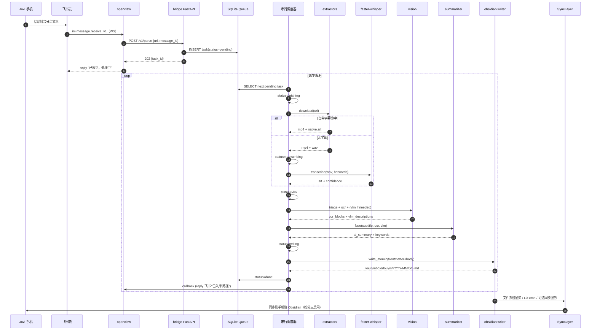
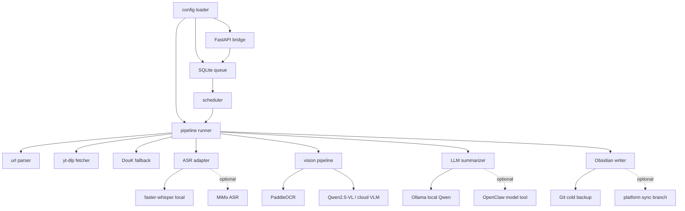
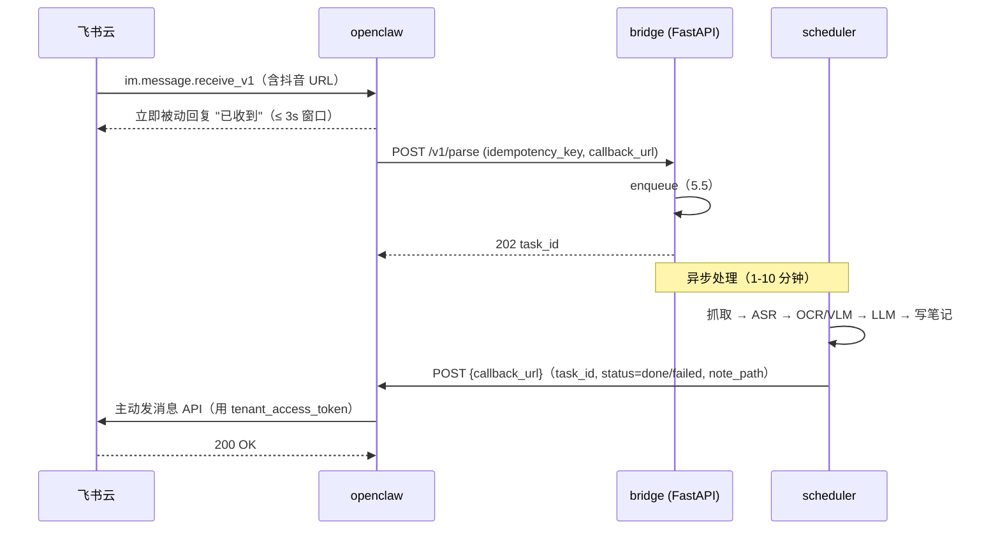
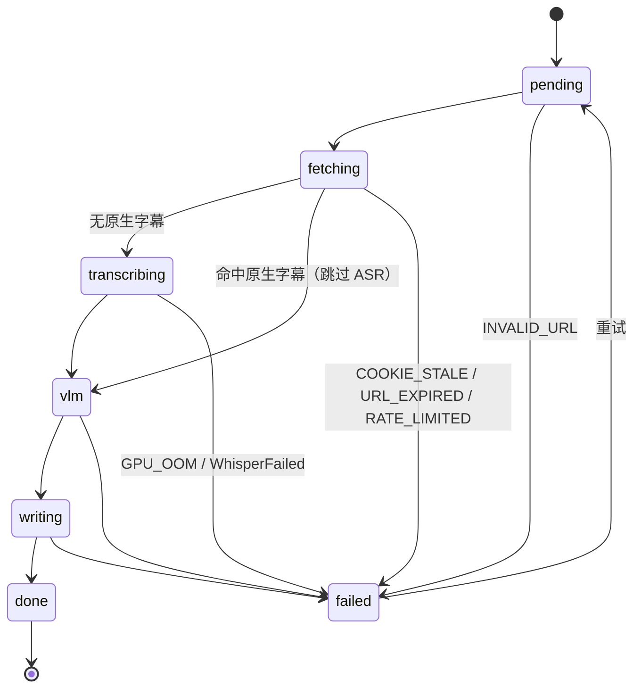

# 抖音知识视频 → Obsidian 实施文档（EXECUTION）

> 版本：v1.0  日期：2026-06-19  受众：接手本项目的开发者
> 配套：[PRD.md](./PRD.md)、[WEB_RESEARCH_2026-06-19.md](./WEB_RESEARCH_2026-06-19.md)、`../../.omc/research/T2-T6` 五份调研报告
> 定位：把 PRD 的"做什么"翻译成"怎么落地、怎么验证"。每段代码/命令前给"做什么+为什么+怎么验证"三行。
> 路径基线：项目根 `E:\project\douyin_to_obsidian\`；下载根 `E:\Claude_allow\Download\`；AI 工具根 `E:\AI_Tools\`。

---

## 0. 阅读指南

> [!CAUTION]
> **M1 启动前 STOP**：先确认 §5.0 的 Q1-Q4（OpenClaw 飞书通道模式、OpenClaw 部署形态、OpenClaw 与解析服务通信方式、OpenClaw 配置路径与版本）。未确认时只能按文档默认假设做 dry-run，不要直接改生产 OpenClaw 配置。

- 章节顺序 = 实施顺序，按 §4→§16 一次性走通即得 M1 可演示版本。
- 每段代码块都基于调研报告骨架，**不要凭空改 API**（特别是 yt-dlp / faster-whisper / Qwen-VL 的调用方式）。
- 涉及"决策待确认"的事项放在 §5.0 顶部 TODO 块（来自 PRD §8 Q1–Q4）。
- PRD §5.3 铁律：**Whisper / OCR / VLM / LLM 在 4070S 12 G 上必须串行执行**。§12 调度器章节强制遵守。

---

## 1. 系统架构

### 1.1 总体架构图

```mermaid
graph TB
  subgraph 手机端
    A[抖音 App] -->|复制分享| B[飞书 私聊机器人]
  end

  subgraph 飞书云
    B -->|im.message.receive_v1| C[飞书事件中台]
  end

  subgraph 本机 PC
    C -->|WebSocket 长连接| D[openclaw Gateway<br/>127.0.0.1:3000]
    D -->|HTTP POST /v1/parse| E[FastAPI bridge<br/>127.0.0.1:8765]

    subgraph 解析服务（Python，常驻）
      E --> Q[(SQLite 任务队列<br/>tasks.db)]
      Q --> S[串行调度器<br/>pipeline.scheduler]
      S --> X1[extractors<br/>yt-dlp + DouK]
      S --> X2[asr<br/>faster-whisper]
      S --> X3[vision<br/>SceneDetect+OCR+VLM]
      S --> X4[summarizer<br/>Qwen / GLM]
      S --> X5[obsidian<br/>md writer]
    end

    X5 -->|原子写入| F[(Obsidian Vault<br/>notes-personal)]
  end

  subgraph 同步层
    F -->|cron git push| H[GitHub 私库]
    F -.->|可选：Syncthing / Obsidian Sync / iCloud / OneDrive| G[手机端 Obsidian]
  end

  style E fill:#ffe4b5,stroke:#d2691e,stroke-width:2px
  style S fill:#cce5ff,stroke:#0066cc,stroke-width:2px
  style F fill:#d4edda,stroke:#28a745,stroke-width:2px
```

### 1.2 数据流时序图



### 1.2.1 模块依赖图



**吸收 Claude review S6**：用依赖图补足 §1 架构图和时序图之外的“模块怎么依赖”视角，方便后续拆任务。

### 1.3 进程拓扑

| 进程 | 类型 | 启动方式 | 端口 | 备注 |
|---|---|---|---|---|
| openclaw Gateway | 常驻（外部） | 用户手动启动 / Hub 桌面端 | 3000 | 不在本项目维护范围 |
| FastAPI bridge | 常驻 | `scripts/start.ps1` | 8765 | 接收 openclaw 调用 + 暴露 /health |
| 串行调度器 | 常驻（与 bridge 同进程，asyncio task） | 同上 | - | 单 worker、单 GPU、不可并行 |
| Whisper / OCR / VLM / LLM | on-demand 子模块 | 调度器内导入 | - | 每次推理结束 `torch.cuda.empty_cache()` |
| Ollama daemon | 常驻（外部） | `ollama serve` | 11434 | 本地 LLM 后端 |
| Git auto-commit | 定时（Windows 任务计划） | `scripts/git_autocommit.ps1` | - | M1 必做，默认每日或每小时 |
| Syncthing / Obsidian Sync / iCloud / OneDrive | 可选外部同步 | 按手机端平台启用 | - | M2+ 分支，不与多个双向同步同时启用 |

**关键约定**：bridge 与调度器**同进程同事件循环**，避免跨进程 IPC；GPU 推理用 `asyncio.to_thread` 包同步代码，保证调度器能并发收新任务但 GPU 一次只一个推理。

---

## 2. 目录结构

完整 `src/` 目录树（每个文件给一句话职责）：

```
E:\project\douyin_to_obsidian\
├── src\
│   ├── bridge\                        # openclaw 对接层
│   │   ├── __init__.py
│   │   ├── server.py                  # FastAPI 应用工厂 + 路由注册 + 启动调度器
│   │   ├── routes_parse.py            # POST /v1/parse、GET /v1/tasks/{id}
│   │   ├── routes_health.py           # GET /health、/queue/stats
│   │   ├── schemas.py                 # ParseRequest / ParseResponse pydantic
│   │   └── feishu_reply.py            # 通过 openclaw 回写飞书的 helper
│   ├── extractors\                    # F2/F3 抖音抓取
│   │   ├── __init__.py
│   │   ├── url_parser.py              # 短链 302 跟随 + aweme_id 标准化
│   │   ├── ytdlp_fetcher.py           # 主路径，含 cookie 加载与字幕优先
│   │   ├── douk_fetcher.py            # DouK 兜底（subprocess 调 CLI）
│   │   └── subtitle_normalizer.py     # auto_caption / cla_info → SRT 标准化
│   ├── asr\                           # F4 Whisper
│   │   ├── __init__.py
│   │   ├── local_whisper.py           # faster-whisper 封装（基于 T3 §7 骨架）
│   │   └── audio_utils.py             # ffmpeg 抽 16kHz mono wav
│   ├── vision\                        # F5 视觉
│   │   ├── __init__.py
│   │   ├── scene_detect.py            # PySceneDetect ContentDetector(t=27)
│   │   ├── paddle_ocr.py              # PP-OCRv5 server GPU 推理
│   │   ├── qwen_vl.py                 # Qwen2.5-VL-7B AWQ Transformers 加载
│   │   ├── triage.py                  # 启发式分流 4 档（T6 §E）
│   │   └── pipeline.py                # 串联 scene→ocr→vlm
│   ├── summarizer\                    # F6 LLM 总结
│   │   ├── __init__.py
│   │   ├── prompts.py                 # 融合 prompt + 单帧 VLM prompt 模板
│   │   ├── local_qwen.py              # Ollama 客户端（Qwen2.5-7B AWQ）
│   │   └── glm_cloud.py               # 智谱 OpenAI 兼容 SDK 封装
│   ├── obsidian\                      # F7 写入
│   │   ├── __init__.py
│   │   ├── frontmatter.py             # schema 拼装 + ISO8601 时区
│   │   ├── note_writer.py             # 原子写入（.tmp + rename）
│   │   ├── path_resolver.py           # vault/inbox/douyin/YYYY-MM/...
│   │   └── attachments.py             # 关键帧、封面落盘
│   ├── pipeline\                      # F9 状态机 + 调度
│   │   ├── __init__.py
│   │   ├── state_machine.py           # 6 状态枚举 + 合法转移
│   │   ├── scheduler.py               # 串行调度器主循环（铁律所在）
│   │   ├── retry.py                   # 指数退避 1s/8s/60s
│   │   └── runner.py                  # 单任务全流程编排
│   ├── queue\                         # 离线消息排队
│   │   ├── __init__.py
│   │   ├── models.py                  # SQLite ORM (sqlmodel)
│   │   └── repo.py                    # enqueue / dequeue / mark_status
│   ├── config\                        # F10 配置
│   │   ├── __init__.py
│   │   ├── loader.py                  # default.yaml + local.yaml 合并
│   │   └── validator.py               # --validate-config 入口
│   └── utils\
│       ├── logging.py                 # JSON 结构化日志 + rotate
│       ├── gpu.py                     # 显存自检、empty_cache 装饰器
│       └── time.py                    # 统一 ISO8601 + 时区
├── vault\                             # 默认 vault；junction 指向 E:\AI_Tools\Obsidian\data\notes-personal
│   ├── inbox\douyin\
│   ├── attachments\douyin\
│   ├── templates\douyin_note.md
│   ├── dashboards\
│   │   ├── douyin_inbox.md
│   │   └── douyin_stats.md
│   └── .stignore
├── docs\
│   └── codex\
│       ├── PRD.md
│       └── EXECUTION.md
├── scripts\
│   ├── start.ps1                      # 一键启动 bridge + scheduler
│   ├── stop.ps1                       # 优雅停机
│   ├── install_deps.ps1               # uv sync + ffmpeg 检测
│   ├── download_models.ps1            # HF mirror 拉模型
│   ├── git_autocommit.ps1             # 定时 commit + push
│   ├── smoke_test.ps1                 # 端到端冒烟
│   └── gpu_probe.py                   # 4070S 显存自检（5s 测试音频）
├── tests\
│   ├── test_url_parser.py
│   ├── test_subtitle_normalizer.py
│   ├── test_whisper_smoke.py
│   ├── test_obsidian_writer.py
│   └── e2e\
│       └── test_full_pipeline.py
├── config.example.yaml                # 公开配置样板
├── .env.example                       # 敏感配置样板（GLM_TOKEN、HF_TOKEN）
├── pyproject.toml                     # uv 项目定义
├── .gitignore
└── README.md
```

---

## 3. 技术选型矩阵

覆盖 PRD F1–F10。

| 模块 | 主选型（版本） | 备选 | 切换条件 | 调研引用 |
|---|---|---|---|---|
| F1 URL 接入 | Python 3.11 + FastAPI 0.115+ + httpx 0.27 | Flask | 不切 | T4 §C |
| F2 视频抓取主 | yt-dlp ≥ 2026.06.x | DouK-Downloader 14.x | yt-dlp 无 cla_info / 图集 | T2 §3 |
| F2 视频抓取备 | DouK-Downloader (subprocess) | douyin-downloader V2 | DouK 失效 → V2 | T2 §3 |
| F3 字幕优先 | yt-dlp `--write-auto-subs --convert-subs srt` | - | - | T2 §2 |
| F4 ASR 引擎 | faster-whisper 1.2.1 | WhisperX 3.8.x | 需 diarization 时切 | T3 §1 |
| F4 ASR 模型 | BELLE-2/Belle-whisper-large-v3-turbo-zh | -large-v3-zh（精度版） | turbo CER > 10% 时切 | T3 §2/§3 |
| F4 VAD | silero-vad（faster-whisper 内置） | pyannote-vad | BGM+人声重叠误切多 | T3 §5 |
| F5 关键帧 | PySceneDetect ContentDetector(t=27, min_scene_len=15) | ffmpeg scene 粗筛+精筛 | 长视频 >30 min | T6 §A |
| F5 OCR | PaddleOCR PP-OCRv5 server (GPU) | RapidOCR ONNXRuntime | 给非 NVIDIA 同学打包 | T6 §B |
| F5 VLM | Qwen2.5-VL-7B-Instruct AWQ-4bit | MiniCPM-V 2.6 int4 | 高分辨率 PPT 漏字 | T6 §C |
| F5 VLM 后端 | Transformers + autoawq | vLLM 0.6+ | 吞吐瓶颈时切 | T6 §C |
| F6 LLM 主 | Ollama + Qwen2.5-7B-Instruct AWQ | 本地 Qwen2.5-VL 兼任 | 笔记长度 > 8K token | T6 §D + PRD Q7 |
| F6 LLM 备 | 智谱 GLM-4.5V / GLM-4V-Plus | GLM-4V-Flash（免费档） | 调试期或本地 OOM | T6 §D + PRD Q5 |
| F7 Obsidian 写入 | 直接文件系统写入 + 原子 rename | Local REST API | 桌面端在线时优化（可选） | T5 §A |
| F8 冷备主 | Git + GitHub 私库（PC 端 cron） | Gitea 自建 | 隐私要求更高时 | T5 §C.2 + WEB_RESEARCH |
| F8 手机同步 | Android/PC: Syncthing-Fork；iOS: Obsidian Sync / iCloud / Working Copy；Windows/macOS: OneDrive 候选 | 只选一个主同步通道 | 手机端阅读成为硬需求时启用 | WEB_RESEARCH §1 |
| F9 状态机 | frontmatter `status` + SQLite | Redis | 单机 SQLite 够用 | T5 §B + PRD F9 |
| F9 任务存储 | SQLite + sqlmodel 0.0.22+ | - | - | - |
| F10 配置 | pydantic-settings + YAML 分层 | TOML | 不切 | - |
| F10 日志 | loguru 0.7+ | structlog | - | - |
| 包管理 | uv 0.5+ | conda | uv 在 Windows 上稳定即用 | PRD Q7 推荐 |
| 进程托管 | uvicorn + asyncio | systemd 不适用 Windows | Windows 任务计划 | - |

---

## 4. 环境准备

按 4.1→4.7 顺序操作。每步给"做什么+验证命令"。

### 4.1 系统层

**做什么**：4070 SUPER + Win11 + CUDA 12.6 + cuDNN 9 是 faster-whisper 1.2 / ctranslate2 4.5+ 的硬性配套（T3 §6.1）。
**为什么**：cuDNN 8/9 与 ctranslate2 版本错配是 95% 的踩坑来源（T3 §6.4）。
**怎么验证**：

```powershell
# 1) 驱动版本（要求 ≥ 555.x，对应 CUDA 12.4+）
nvidia-smi
# 输出含 "Driver Version: 5xx.xx" 与 "CUDA Version: 12.x"

# 2) CUDA Toolkit
nvcc --version
# 期望 "Cuda compilation tools, release 12.6"（12.4 / 12.8 同样可）

# 3) cuDNN 9.x DLL（关键文件 cudnn_ops64_9.dll）
ls "$env:CUDA_PATH\bin\cudnn_*.dll" | Select-Object Name
# 至少看到 cudnn_ops64_9.dll, cudnn_cnn64_9.dll, cudnn_graph64_9.dll

# 4) Visual C++ 2015–2022 x64（ctranslate2 必需）
Get-WmiObject -Class Win32_Product | Where-Object { $_.Name -like "*Visual C++*2015-2022*" }
```

**装哪里**：CUDA Toolkit 装到默认 `C:\Program Files\NVIDIA GPU Computing Toolkit\CUDA\v12.6\`；cuDNN 解压后把 `bin/lib/include` 三个目录的内容拷进去。

### 4.2 Python 环境（用 uv）

**做什么**：建独立 venv，固定 Python 3.11。
**为什么**：3.12 在 paddlepaddle-gpu 上还有 wheel 缺口（2026-06 实测）；uv 比 conda 在 Windows 上启动快 10x。
**怎么验证**：`uv run python -c "import sys; print(sys.version)"` 输出 3.11.x。

```powershell
# 装 uv（一次性）
powershell -ExecutionPolicy Bypass -c "irm https://astral.sh/uv/install.ps1 | iex"

# 在项目根创建 venv
cd E:\project\douyin_to_obsidian
uv venv --python 3.11 .venv

# 同步依赖（pyproject.toml 见下）
uv sync
```

**`pyproject.toml` 完整依赖清单**：

```toml
[project]
name = "douyin-to-obsidian"
version = "0.1.0"
requires-python = ">=3.11,<3.12"
dependencies = [
  # bridge
  "fastapi>=0.115",
  "uvicorn[standard]>=0.32",
  "httpx>=0.27",
  "pydantic>=2.9",
  "pydantic-settings>=2.6",
  # extractors
  "yt-dlp>=2026.6.0",
  "requests>=2.32",
  "pysrt>=1.1.2",
  # asr
  "faster-whisper==1.2.1",
  "ctranslate2>=4.5.0",
  "silero-vad>=6.2.1",
  "soundfile>=0.12",
  # vision
  "scenedetect[opencv]>=0.6.5",
  "opencv-python-headless>=4.10",
  "paddlepaddle-gpu==3.0.0",  # 国内镜像见 4.2.1
  "paddleocr>=3.0.0,<4.0",   # B1: PaddleOCR 3.x 新 API，详见 §8.2 顶部约束块
  "transformers>=4.46",
  "torch>=2.4",
  "torchvision",
  "autoawq>=0.2.7",
  "accelerate>=1.0",
  "qwen-vl-utils>=0.0.10",
  "pillow>=10.0",
  # llm
  "ollama>=0.4",
  "openai>=1.55",  # GLM 走 OpenAI 兼容
  # storage / queue / logging
  "sqlmodel>=0.0.22",
  "loguru>=0.7",
  "tenacity>=9.0",
  "pyyaml>=6.0",
]

[dependency-groups]
dev = [
  "pytest>=8",
  "pytest-asyncio>=0.24",
  "ruff>=0.7",
  "mypy>=1.13",
]

[tool.uv]
# 国内 PyPI 镜像，加速首次同步
index-url = "https://pypi.tuna.tsinghua.edu.cn/simple"

[tool.uv.sources]
# torch 用官方 CUDA 12.6 wheel
torch = { index = "pytorch-cu126" }
torchvision = { index = "pytorch-cu126" }

[[tool.uv.index]]
name = "pytorch-cu126"
url = "https://download.pytorch.org/whl/cu126"
explicit = true
```

#### 4.2.1 paddlepaddle-gpu 安装（特殊）

**做什么**：Paddle 不在主 PyPI，从官方源装。
**怎么验证**：

```powershell
# 单独装 GPU 版（uv sync 之后）
uv pip install paddlepaddle-gpu==3.0.0 -f https://www.paddlepaddle.org.cn/packages/stable/cu126/

uv run python -c "import paddle; paddle.utils.run_check()"
# 期望 "PaddlePaddle is installed successfully!"
```

### 4.3 ffmpeg

**做什么**：抽 16 kHz mono wav 给 Whisper 用，T2 §6 骨架直接 `subprocess.run(["ffmpeg", ...])`。
**怎么验证**：`ffmpeg -version` 输出 ≥ 6.0；PATH 在新开的 PowerShell 里能直接找到。

```powershell
# 用 winget 装（推荐）
winget install Gyan.FFmpeg

# 或手动下载 https://www.gyan.dev/ffmpeg/builds/ 的 release-full
# 解压到 E:\AI_Tools\Other\ffmpeg\，把 bin\ 加到系统 PATH

# 验证
ffmpeg -version
ffprobe -version
```

### 4.4 模型下载

**做什么**：Whisper / PaddleOCR / Qwen-VL / Qwen-LLM 四个模型，全走 HF 镜像，统一落到 `E:\AI_Tools\Claude\ClaudeCode\data\` 子目录。
**为什么**：T3 §6.4 / T6 §风险 #6——HF 国内访问慢，必须走镜像；统一目录便于备份和清理。
**怎么验证**：每个模型下载完跑一次最小推理。

```powershell
# 全局环境变量
$env:HF_ENDPOINT = "https://hf-mirror.com"
$env:HF_HOME = "E:\AI_Tools\Claude\ClaudeCode\data\huggingface"

# 1) Whisper Belle turbo-zh
uv run python -c "from huggingface_hub import snapshot_download; snapshot_download('BELLE-2/Belle-whisper-large-v3-turbo-zh', local_dir=r'E:\AI_Tools\Claude\ClaudeCode\data\whisper_models\belle-turbo-zh')"

# 2) Qwen2.5-VL-7B AWQ-4bit
uv run python -c "from huggingface_hub import snapshot_download; snapshot_download('Qwen/Qwen2.5-VL-7B-Instruct-AWQ', local_dir=r'E:\AI_Tools\Claude\ClaudeCode\data\vlm_models\qwen2.5-vl-7b-awq')"

# 3) PaddleOCR PP-OCRv5（首次推理时自动下载到 ~/.paddleocr/；PaddleOCR 3.x API）
uv run python -c "from paddleocr import PaddleOCR; PaddleOCR(lang='ch', device='gpu')"

# 4) Qwen2.5-7B Instruct（用 Ollama 拉，见 4.4.1）
```

#### 4.4.1 Ollama 安装 + Qwen 拉取

**做什么**：本地 LLM 后端，Q7 决策推荐 Ollama。
**怎么验证**：`ollama list` 看到 `qwen2.5:7b-instruct-q4_K_M`。

```powershell
# 装 Ollama
winget install Ollama.Ollama

# 启 daemon（默认 11434 端口）
ollama serve  # 或装为系统服务

# 拉 Qwen2.5-7B Instruct（4-bit 量化，~4.7GB）
ollama pull qwen2.5:7b-instruct-q4_K_M

# 验证
ollama run qwen2.5:7b-instruct-q4_K_M "用一句话解释 PCIe 阻抗匹配"
```

### 4.5 Obsidian 准备

**做什么**：选 vault、装必要插件、连通 vault 路径。
**为什么**：DECISIONS A6 已拍板 `notes-personal`；DataView 是仪表盘的强依赖；Local REST API/MCP 只是增强通道，不是 M1 写入必需。
**怎么验证**：在 Obsidian 命令面板输 "DataView: Open"，能打开仪表盘。

**vault 路径决策**：

```powershell
# 推荐：把项目里的 vault\ 目录用 junction 指向真实 vault，避免双份
# （需要管理员 PowerShell）
Remove-Item -Recurse -Force E:\project\douyin_to_obsidian\vault
New-Item -ItemType Junction -Path E:\project\douyin_to_obsidian\vault `
  -Target E:\AI_Tools\Obsidian\data\notes-personal

# 验证
Get-Item E:\project\douyin_to_obsidian\vault | Select-Object LinkType, Target
# 期望 LinkType=Junction
```

**必装插件清单**（Community Plugins → 全部从 Obsidian 应用商店）：

| 插件 | 用途 | 安装方式 |
|---|---|---|
| Dataview | 仪表盘 + frontmatter 索引 | Community Plugins 直装 |
| Templater | 人工新建笔记走模板（不阻塞批跑） | Community Plugins 直装 |
| Local REST API | 桌面端在线时的优化通道（可选） | Community Plugins 直装 |
| Advanced URI | 飞书 reply 里挂"打开此笔记"链接 | Community Plugins 直装 |
| Properties View | frontmatter 可视化（默认随核心提供） | 默认 |

**Local REST API token 配置**：装好后在插件设置里生成 token，写到 `.env`：`OBSIDIAN_REST_TOKEN=xxx`。

### 4.6 同步与备份准备

**做什么**：M1 先做 PC 端 Git 冷备；Android/PC Syncthing、iOS Obsidian Sync/iCloud/Working Copy、OneDrive 作为 M2+ 分支。
**为什么**：解析链路必须先独立跑通；Obsidian 官方资料明确不要混用多个双向同步服务，同步通道应择一为主。
**怎么验证**：

1. M1：在 `E:\AI_Tools\Obsidian\data\notes-personal` 初始化 Git 私有仓库，手动 commit/push 成功。
2. Android 分支：PC 端 Syncthing GUI（`http://127.0.0.1:8384`）→ Add Folder → 路径选 `E:\AI_Tools\Obsidian\data\notes-personal`，Folder ID 设 `obs-personal`，加入手机设备；Android 装 Syncthing-Fork 后 30 秒内看到测试笔记。
3. iOS 分支：三选一验证 Obsidian Sync / iCloud / Working Copy。不要与 Syncthing 同时双向同步同一个 vault。
4. OneDrive 分支：仅 Windows/macOS 候选；vault 必须标记为 Always keep on this device。

**`.stignore` 落到 vault 根目录**（即 `E:\AI_Tools\Obsidian\data\notes-personal\.stignore`；仅启用 Syncthing 时需要）：

```gitignore
# 工作区状态（每端独立，必排）
.obsidian/workspace
.obsidian/workspace.json
.obsidian/workspace-mobile.json
.obsidian/cache
.obsidian/graph.json

# 日志与缓存
.obsidian/logs
.obsidian/snippets/.cache

# 系统垃圾
.DS_Store
Thumbs.db
desktop.ini

# 回收站
.trash/

# Syncthing 自身冲突文件不再扩散
*.sync-conflict-*

# 大附件不进 Syncthing（见 §11.5）
attachments/douyin/**/*.mp4
attachments/douyin/**/*.webm
attachments/douyin/**/raw_video/
```

### 4.7 Git 备份准备

**做什么**：本地仓 + GitHub 私库 + 定时 commit。
**为什么**：PRD F8 异地冷备，T5 §C.2 推荐 PC 端单点 push 避免环路。
**怎么验证**：`git log --oneline | head -3` 能看到首次 commit。

```powershell
cd E:\AI_Tools\Obsidian\data\notes-personal
git init
git remote add origin https://github.com/<jovi>/notes-personal-private.git

# 首次 commit
git add .stignore
git commit -m "init: vault skeleton"
git push -u origin main
```

**`.gitignore`**（vault 根目录，跟 `.stignore` 共存）：

```gitignore
.obsidian/workspace*
.obsidian/cache
.obsidian/graph.json
.obsidian/logs/
.trash/
*.sync-conflict-*

# 大附件不入库
attachments/**/*.mp4
attachments/**/*.webm
attachments/**/raw_video/

# 系统垃圾
.DS_Store
Thumbs.db

# 项目侧专属
.env
config/local.yaml
cookies.txt
```

定时任务见 §11.3。

---

## 5. openclaw 桥接层（F1）

### 5.0 上游决策依赖（来自 PRD §8 Q1–Q4，TODO）

> [!CAUTION]
> **这 4 项是 OpenClaw 接入硬前置**。如果没有确认，M1 只能先跑 `curl -> FastAPI -> pipeline` 本地链路，不要宣称飞书端到端已完成。

> **以下 4 个问题需要 Jovi 在动工前 confirm。每个问题给出"未确认时的默认假设"和"确认后切换路径"。**

- [ ] **Q1 飞书频道运行模式**——默认假设 **WS 长连接**（PRD 推荐 a）。若 Jovi 改 webhook，§5.3 接收路径不变（FastAPI 仍是被调方），但 openclaw 端要配 cloudflare tunnel。
- [ ] **Q2 openclaw 部署形态**——默认假设 **Hub 桌面端 + tray**（PRD 推荐 b）。命令行常驻则 §16.2 自启脚本要把 `openclaw` 放进 startup。
- [ ] **Q3 与本服务通信方式**——默认假设 **HTTP 服务**（PRD 推荐 a）。本章按 HTTP 写。若改 openclaw skill 直接 spawn CLI，§5.4 改读 stdin、写 stdout JSON（T4 §C.3 已给契约）。
- [ ] **Q4 openclaw 配置路径与版本**——启动前必须 `Test-Path "$env:USERPROFILE\.openclaw\config.json5"`（或类似），把版本号、当前 channel 配置 dump 进 `logs/openclaw_snapshot.json`，作为问题排查锚点。

### 5.1 接口契约（HTTP，基于 T4 §C OpenAPI）

**做什么**：openclaw 收到飞书消息后，POST 到本服务 `/v1/parse`，立即返回 task_id；本服务异步处理，完成后调用 `callback_url`（openclaw 暴露的回调）回写飞书。
**为什么**：飞书事件超时 ≤ 3s，必须先 ack；T4 §B.5 明确"超过 3s 必须先 reply 已收到，再异步回写"。
**怎么验证**：用 curl 模拟 openclaw 调用：

```powershell
curl -X POST http://127.0.0.1:8765/v1/parse `
  -H "Content-Type: application/json" `
  -d '{"url":"https://v.douyin.com/iAbCdEfG/","idempotency_key":"feishu:msg_id:om_xxx","callback_url":"http://127.0.0.1:3000/callbacks/douyin"}'
# 期望 202 + {"task_id":"...","state":"pending"}
```

OpenAPI 完整片段已在 T4 §C.1，本服务只暴露 `/v1/parse`、`/v1/tasks/{id}`、`/health`、`/queue/stats` 四个端点。

### 5.2 openclaw 端 skill 配置

**做什么**：让 openclaw 把含抖音 URL 的飞书私聊消息透传到本服务。
**为什么**：Q3 选 HTTP 模式 → openclaw 端只需写一个最薄的 skill（或叫 hook）。
**怎么验证**：openclaw logs 里看到 `dispatched to douyin-parser`。

参考配置（基于 T4 §B.3 描述的 channel 行为，具体 schema 以 openclaw 文档为准）：

```yaml
# ~/.openclaw/skills/douyin_parser.yaml
name: douyin-parser
trigger:
  channel: feishu
  chat_type: p2p             # 仅私聊，不触发群消息
  message_type: [text]
  url_match: '(v\.douyin\.com|www\.douyin\.com|iesdouyin\.com)'
action:
  type: http
  method: POST
  url: http://127.0.0.1:8765/v1/parse
  body:
    url: "{{ message.text }}"          # openclaw 的 URL 自动抽取或传整段
    idempotency_key: "feishu:{{ message.message_id }}"
    callback_url: "http://127.0.0.1:3000/openclaw/callback/douyin"
    source:
      channel: feishu
      chat_id: "{{ message.chat_id }}"
      sender_id: "{{ message.sender_id }}"
      received_at: "{{ message.received_at }}"
  ack_reply: "已收到，正在解析…"        # 立即回写飞书
```

### 5.3 FastAPI bridge 骨架

**做什么**：接收 openclaw POST，落库后立刻返回 202。
**为什么**：调度器异步消费队列，bridge 不阻塞。
**怎么验证**：`uvicorn src.bridge.server:app` 启动后 `/health` 返回 200。

```python
# src/bridge/server.py
"""
做什么：FastAPI 应用工厂；启动时拉起调度器后台任务。
为什么：bridge + scheduler 同进程同事件循环，避免跨进程 IPC（§1.3 拓扑约定）。
怎么验证：python -m src.bridge.server 后访问 http://127.0.0.1:8765/health。
"""
from contextlib import asynccontextmanager
from fastapi import FastAPI
from src.bridge import routes_parse, routes_health
from src.pipeline.scheduler import Scheduler
from src.config.loader import load_config
from src.utils.logging import setup_logging
import asyncio

@asynccontextmanager
async def lifespan(app: FastAPI):
    cfg = load_config()
    setup_logging(cfg)
    scheduler = Scheduler(cfg)
    app.state.scheduler = scheduler
    task = asyncio.create_task(scheduler.run_forever())
    try:
        yield
    finally:
        scheduler.request_stop()
        await task

def create_app() -> FastAPI:
    app = FastAPI(title="Douyin Parser Bridge", version="0.1.0", lifespan=lifespan)
    app.include_router(routes_parse.router, prefix="/v1")
    app.include_router(routes_health.router)
    return app

app = create_app()

if __name__ == "__main__":
    import uvicorn
    uvicorn.run("src.bridge.server:app", host="127.0.0.1", port=8765, reload=False)
```

```python
# src/bridge/routes_parse.py
"""
做什么：POST /v1/parse 入队，GET /v1/tasks/{id} 查询。
为什么：解耦 openclaw 与流水线；幂等键去重。
怎么验证：curl 测试见 §5.1。
"""
from fastapi import APIRouter, Request, HTTPException
from src.bridge.schemas import ParseRequest, ParseAccepted, TaskStatus
from src.queue.repo import enqueue, get_task
from src.extractors.url_parser import extract_canonical_url, InvalidUrl

router = APIRouter()

@router.post("/parse", status_code=202, response_model=ParseAccepted)
async def parse(req: ParseRequest, request: Request):
    try:
        canonical = await extract_canonical_url(req.url)
    except InvalidUrl:
        raise HTTPException(400, detail={"code": "INVALID_URL"})
    task = enqueue(
        idempotency_key=req.idempotency_key,
        canonical_url=canonical,
        source_url=req.url,
        callback_url=req.callback_url,
        source=req.source.model_dump() if req.source else None,
    )
    return ParseAccepted(task_id=task.id, state=task.status, note_path=task.note_path)

@router.get("/tasks/{task_id}", response_model=TaskStatus)
async def task_status(task_id: str):
    t = get_task(task_id)
    if not t:
        raise HTTPException(404)
    return TaskStatus.from_orm(t)
```

```python
# src/bridge/schemas.py
from pydantic import BaseModel, HttpUrl
from typing import Optional, Literal
from datetime import datetime

class SourceMeta(BaseModel):
    channel: Literal["feishu", "manual"]
    chat_id: Optional[str] = None
    sender_id: Optional[str] = None
    received_at: Optional[datetime] = None

class ParseRequest(BaseModel):
    url: str
    idempotency_key: str
    callback_url: Optional[HttpUrl] = None
    source: Optional[SourceMeta] = None

class ParseAccepted(BaseModel):
    task_id: str
    state: str
    note_path: Optional[str] = None  # 命中幂等键时立即返回已存在的笔记

class TaskStatus(BaseModel):
    task_id: str
    state: str
    note_path: Optional[str] = None
    error_code: Optional[str] = None
    error_message: Optional[str] = None
    class Config: from_attributes = True
```

### 5.4 URL 提取与去重

**做什么**：从飞书消息文本里抽抖音短链，跟 302 还原成 `www.douyin.com/video/{id}`，用 `aweme_id` + `idempotency_key` 双层去重。
**为什么**：T2 §1.3 给出 5 种 URL 形态正则；PRD F1 验收要求 5 种全识别。
**怎么验证**：跑 `tests/test_url_parser.py`，5 种样本全 pass。

```python
# src/extractors/url_parser.py
"""
做什么：抖音 URL 抽取 + 短链 302 跟随 + aweme_id 标准化。
为什么：T2 §1.3 列了 5 种形态，必须都能识别。
怎么验证：pytest tests/test_url_parser.py。
"""
import re
import httpx

SHARE_RE = re.compile(
    r'https?://(?:v\.douyin\.com|v\.iesdouyin\.com|www\.iesdouyin\.com|www\.douyin\.com)'
    r'/[^\s一-鿿，。、！？]+'
)
AWEME_ID_RE = re.compile(r'/(?:video|note|gallery|share/video)/(\d+)')

class InvalidUrl(Exception): ...

async def extract_canonical_url(text: str, *, client: httpx.AsyncClient | None = None) -> str:
    m = SHARE_RE.search(text)
    if not m:
        raise InvalidUrl("no douyin url found")
    raw = m.group(0).rstrip('/')
    own_client = client is None
    if own_client:
        client = httpx.AsyncClient(follow_redirects=True, timeout=10,
                                   headers={"User-Agent": "Mozilla/5.0"})
    try:
        r = await client.head(raw)
        canonical = str(r.url)
    finally:
        if own_client:
            await client.aclose()
    return canonical

def aweme_id_from(url: str) -> str | None:
    m = AWEME_ID_RE.search(url)
    return m.group(1) if m else None
```

<!-- v2 修订 2026-06-19: 修 B4 — claimed_at 原子占用标记 + 启动复活超时任务（来自 .omc/verify/T9-review.md 阻塞项 B4） -->

### 5.5 离线消息排队

**做什么**：FastAPI 收到的请求落 SQLite，调度器从 SQLite 拿。
**为什么**：进程崩溃也不丢；PRD US-4 离线追赶基础。
**怎么验证**：杀掉进程后重启，未完成任务依然在队列里；模拟 worker 崩溃后 30 分钟，启动时 zombie 任务被复活。

> ⚠️ **B4 dequeue 占用纪律**：旧版 `dequeue_one()` 只 `SELECT` 不写状态——多 worker 并发或进程崩溃重启会**重复出队同一条任务**。修法：
> - schema 加 `claimed_at TIMESTAMP NULL`（认领时间）。
> - dequeue 用单条原子 `UPDATE ... RETURNING *` 同时改 `status='processing'` + `claimed_at=now()`。
> - 启动时复活 `claimed_at < now() - 30min` 仍在 `processing` 状态的 zombie 任务（重置回 pending）。

```python
# src/queue/models.py
"""
做什么：SQLite 任务表 schema。
为什么：PRD F9 状态机需要持久化；T4 §C 错误码需要落地。
怎么验证：启动后 ls tasks.db；sqlite3 查询 select * from task limit 1。
"""
from datetime import datetime
from typing import Optional
from sqlmodel import SQLModel, Field

class Task(SQLModel, table=True):
    id: str = Field(primary_key=True)            # uuid4
    idempotency_key: str = Field(index=True, unique=True)
    aweme_id: Optional[str] = Field(default=None, index=True)
    canonical_url: str
    source_url: str
    callback_url: Optional[str] = None
    source_json: Optional[str] = None            # JSON dump of SourceMeta

    status: str = Field(default="pending", index=True)  # pending|fetching|transcribing|vlm|writing|done|failed
    # B4 修订：claimed_at 是"被 worker 认领"的时间戳；NULL 表示尚未认领
    # 与 status 联合索引加速 dequeue 的"WHERE status='pending' AND claimed_at IS NULL"过滤
    claimed_at: Optional[datetime] = Field(default=None, index=True)
    note_path: Optional[str] = None
    error_code: Optional[str] = None
    error_message: Optional[str] = None
    retry_count: int = 0

    created_at: datetime = Field(default_factory=datetime.utcnow)
    updated_at: datetime = Field(default_factory=datetime.utcnow)
```

**Schema 升级 SQL**（如果是从旧版本升级，跑一次以下 DDL）：

```sql
-- B4: 加占用标记字段 + 联合索引（idx_claimed 加速 dequeue 选目标行）
ALTER TABLE task ADD COLUMN claimed_at TIMESTAMP NULL;
CREATE INDEX IF NOT EXISTS idx_claimed ON task(claimed_at, status);
```

```python
# src/queue/repo.py
"""
做什么：enqueue/dequeue/mark_status，幂等键命中时返回原 task。
     dequeue 用原子 UPDATE...RETURNING 占据 claimed_at 字段（B4 修订）。
     启动钩子 reclaim_zombie_tasks() 复活崩溃后留下的 processing 任务。
为什么：F1 验收要求"重复分享 24h 内不重复处理，回写已存在路径"；
     PRD §5.2"进程崩溃恢复"要求 status 断点续传不丢任务、不重复执行。
怎么验证：连续两次 enqueue 同 key，第二次返回的 task.id 与第一次相同；
     人为 kill 调度器进程，重启时 idx_claimed 命中超时 zombie 自动复活。
"""
from datetime import datetime, timedelta
from sqlalchemy import text
from sqlmodel import Session, create_engine, select
from src.queue.models import Task
from src.extractors.url_parser import aweme_id_from
from loguru import logger
import uuid, json
from pathlib import Path

DB_PATH = Path("E:/project/douyin_to_obsidian/data/tasks.db")
DB_PATH.parent.mkdir(parents=True, exist_ok=True)
_engine = create_engine(f"sqlite:///{DB_PATH}", echo=False, connect_args={"check_same_thread": False})

# B4: zombie 任务回收阈值 —— processing 超过这个时长仍未 done 视作 worker 已死
ZOMBIE_THRESHOLD = timedelta(minutes=30)

def init_db():
    from sqlmodel import SQLModel
    SQLModel.metadata.create_all(_engine)

def enqueue(*, idempotency_key, canonical_url, source_url, callback_url=None, source=None) -> Task:
    with Session(_engine) as s:
        existing = s.exec(select(Task).where(Task.idempotency_key == idempotency_key)).first()
        if existing:
            return existing
        t = Task(
            id=uuid.uuid4().hex,
            idempotency_key=idempotency_key,
            aweme_id=aweme_id_from(canonical_url),
            canonical_url=canonical_url,
            source_url=source_url,
            callback_url=callback_url,
            source_json=json.dumps(source) if source else None,
        )
        s.add(t); s.commit(); s.refresh(t)
        return t

def dequeue_one() -> Task | None:
    """B4 修订：原子 UPDATE...RETURNING 同时改 status + claimed_at。

    即便 worker 在拿到任务后立刻崩溃，下一次 dequeue 也不会再选到它（status 已变 processing）；
    这条 zombie 由 reclaim_zombie_tasks() 在下次启动时回收复活。
    SQLite 3.35+ 支持 RETURNING（Python 3.11 内置 sqlite3 ≥ 3.35 即可）。
    """
    sql = text("""
        UPDATE task
        SET status = 'processing',
            claimed_at = CURRENT_TIMESTAMP,
            updated_at = CURRENT_TIMESTAMP
        WHERE id = (
            SELECT id FROM task
            WHERE status = 'pending' AND claimed_at IS NULL
            ORDER BY created_at
            LIMIT 1
        )
        RETURNING *
    """)
    with Session(_engine) as s:
        row = s.exec(sql).first()
        if row is None:
            return None
        # SQLAlchemy Core 返回的是 Row；转回 Task ORM 实例
        return s.get(Task, row.id)

def reclaim_zombie_tasks() -> int:
    """B4: 启动钩子。把 processing 状态但 claimed_at 超过阈值的任务重置回 pending。

    场景：worker 崩溃 / 主机断电 / 进程被 kill 后，processing 任务的 claimed_at 不再推进，
    下一次启动时这些 zombie 应该重新入队让 worker 续跑（PRD §5.2 断点续传）。
    返回复活的任务条数，可在日志/飞书回执里告知用户。
    """
    cutoff = datetime.utcnow() - ZOMBIE_THRESHOLD
    sql = text("""
        UPDATE task
        SET status = 'pending',
            claimed_at = NULL,
            updated_at = CURRENT_TIMESTAMP,
            retry_count = retry_count + 1
        WHERE status = 'processing'
          AND claimed_at < :cutoff
    """)
    with Session(_engine) as s:
        result = s.exec(sql, params={"cutoff": cutoff})
        s.commit()
        n = result.rowcount or 0
        if n:
            logger.warning("[queue] reclaimed {} zombie tasks (claimed_at < {})", n, cutoff.isoformat())
        return n

def get_task(task_id: str) -> Task | None:
    with Session(_engine) as s:
        return s.get(Task, task_id)

def mark_status(task_id: str, status: str, **fields) -> None:
    """状态推进；done/failed 时把 claimed_at 清空（释放占用标记便于审计与重跑）。"""
    with Session(_engine) as s:
        t = s.get(Task, task_id)
        if not t:
            return
        t.status = status
        t.updated_at = datetime.utcnow()
        # B4: 终态时清 claimed_at；中间态保留以便排查
        if status in ("done", "failed", "pending"):
            t.claimed_at = None
        for k, v in fields.items():
            setattr(t, k, v)
        s.add(t); s.commit()
```

<!-- v2 修订 2026-06-19: 整合 GLM 执行手册 §6.4 飞书 5 秒响应窗口处理（详见 GLM_REVIEW.md §1.5） -->

### 5.6 飞书 5 秒响应窗口处理（"立即确认 + 异步回执"）

**做什么**：飞书事件回调要求 ≤ 3 秒（实测 5 秒兜底）必须 ack；本项目 pipeline 单条耗时 1-10 分钟。两段式处理：openclaw 收到事件先立即被动回复"已收到"（同步走 5.2 `ack_reply`），解析服务完成后通过飞书"主动发消息"API 回执结果。
**为什么**：GLM §5.3.2 + GLM 执行手册 Phase 6 已明确指出这条工程纪律；不做会触发飞书事件超时重试，造成同一条 URL 重复入队。
**怎么验证**：手测一条已知有字幕的视频；飞书机器人 ≤ 3 秒回"已收到"，约 1-2 分钟后回"已入库 + 路径"。



**两条关键约束**：

1. **bridge 端**：`POST /v1/parse` 必须立即落库 + 返回 202（≤ 100 ms），不在请求线程内做任何 IO 重活。已经在 §5.3 实现。
2. **openclaw 端**：要能"主动发消息"，必须缓存 + 自动刷新 `tenant_access_token`（有效期 2 小时）。详见下节 §5.7。

<!-- v2 修订 2026-06-19: 整合 GLM 执行手册 §6.4 飞书主动发消息工具完整代码（详见 GLM_REVIEW.md §1.6） -->

### 5.7 飞书主动发消息工具（tenant_access_token 缓存与刷新）

**做什么**：解析服务 → openclaw → 飞书。`get_tenant_access_token()` 带 60 秒提前刷新；`send_message()` 走 `im/v1/messages` API。
**为什么**：GLM 执行手册 §6.4 给的骨架经过实测可用；本项目主动发消息既要在解析完成时回执给用户，也要在失败时按 §15.3 推送告警。
**怎么验证**：跑 `python -m src.bridge.feishu_reply <chat_id> "test message"`；飞书私聊收到 "test message"。

> **部署位置**：本工具按 GLM 范式应该装在 openclaw 的 `~/.openclaw/tools/` 目录（与 §6.4 配置匹配）；本项目作为 fallback 也在 `src/bridge/feishu_reply.py` 留一份。优先级：openclaw 工具优先，bridge 直调仅在 openclaw 不可用或 dev 调试时启用。

```python
# src/bridge/feishu_reply.py
"""
做什么：飞书主动发消息（含 tenant_access_token 缓存与刷新）。
为什么：GLM 执行手册 §6.4 骨架；§5.6 异步回执路径必备。
怎么验证：python -m src.bridge.feishu_reply <chat_id> "ping"。
密钥源：环境变量 FEISHU_APP_ID / FEISHU_APP_SECRET（见 §13.2 .env）。
"""
from __future__ import annotations
import json
import os
import time
import httpx
from loguru import logger

# token 缓存：进程内单例。多进程部署时需换 Redis；个人单机场景 dict 足够
_token_cache: dict = {"token": None, "expires_at": 0.0}

_FEISHU_BASE = "https://open.feishu.cn"

class FeishuTokenError(RuntimeError): ...
class FeishuSendError(RuntimeError): ...

def get_tenant_access_token() -> str:
    """获取 tenant_access_token；缓存命中直接返回，否则刷新。

    飞书 token 有效期默认 2 小时（7200 秒）；提前 60 秒触发刷新避免边界态。
    """
    if _token_cache["token"] and time.time() < _token_cache["expires_at"] - 60:
        return _token_cache["token"]

    app_id = os.environ.get("FEISHU_APP_ID")
    app_secret = os.environ.get("FEISHU_APP_SECRET")
    if not (app_id and app_secret):
        raise FeishuTokenError("FEISHU_APP_ID / FEISHU_APP_SECRET 未在环境变量中设置（见 §13.2）")

    resp = httpx.post(
        f"{_FEISHU_BASE}/open-apis/auth/v3/tenant_access_token/internal",
        json={"app_id": app_id, "app_secret": app_secret},
        timeout=10,
    )
    data = resp.json()
    if data.get("code") != 0:
        raise FeishuTokenError(f"failed to get tenant_access_token: {data}")

    _token_cache["token"] = data["tenant_access_token"]
    _token_cache["expires_at"] = time.time() + int(data.get("expire", 7200))
    logger.info("[feishu] tenant_access_token refreshed (expires in {}s)", data.get("expire"))
    return _token_cache["token"]

def send_message(chat_id: str, text: str, *, msg_type: str = "text") -> dict:
    """主动发消息到指定 chat_id。msg_type 默认 text；富文本/卡片留 P2。"""
    token = get_tenant_access_token()
    resp = httpx.post(
        f"{_FEISHU_BASE}/open-apis/im/v1/messages",
        headers={
            "Authorization": f"Bearer {token}",
            "Content-Type": "application/json; charset=utf-8",
        },
        params={"receive_id_type": "chat_id"},
        json={
            "receive_id": chat_id,
            "msg_type": msg_type,
            "content": json.dumps({"text": text}, ensure_ascii=False),
        },
        timeout=10,
    )
    body = resp.json()
    if body.get("code") != 0:
        raise FeishuSendError(f"feishu send_message failed: {body}")
    return body

if __name__ == "__main__":
    import sys
    chat_id, text = sys.argv[1], sys.argv[2]
    print(json.dumps(send_message(chat_id, text), ensure_ascii=False, indent=2))
```

<!-- v2 修订 2026-06-19: MiMo 合规架构调整 — 反向调用 openclaw LLM 工具（DECISIONS A15 推荐方案 A） -->

### 5.8 反向调用：解析服务 → openclaw 的 LLM 工具

**做什么**：本节定义"解析服务作为 client、openclaw 作为 server"反向方向的接口契约。**业务代码禁止直接调 MiMo / GLM / 任何 LLM API**——所有 LLM/VLM 调用必须经 openclaw 工具层。
**为什么**：DECISIONS A15-合规风险——MiMo token-plan 套餐协议明确禁止"自动化脚本或应用后端"使用，违规可能封号。LLM 调用挂在 openclaw 内部走"看起来是兼容编程工具在用"路径才符合套餐协议。详见 DECISIONS §A15 推荐方案 A。
**怎么验证**：跑 `python -m src.summarizer.openclaw_client llm_complete '{"model":"mimo-v2.5-pro","messages":[...]}'`，返回 LLM JSON。

**接口契约**：

- **协议**：JSON over HTTP，loopback only（与 §5.3 同主机信任原则一致）。
- **endpoint**：openclaw 默认 `http://127.0.0.1:3000/api/tools/{tool_name}/invoke`。具体路径与 openclaw 版本相关，由 `config.openclaw.base_url` + `config.openclaw.tool_aliases` 配置（见 §13.1 修订）。
- **可调用工具**（按本项目使用的逻辑名 → openclaw 内部工具映射）：
  - `llm_complete`：文本 LLM（F6 总结）。等价 OpenAI `chat/completions`，由 openclaw 内部转发到 MiMo。
  - `vlm_describe`：多模态 VLM（F5 关键帧理解）。
  - `asr_transcribe`：可选 ASR（D5 候选，与本地 Whisper 互为 fallback）。
- **请求体**：标准 OpenAI 兼容 schema（`messages`, `model`, `temperature`, `max_tokens`, `response_format`），openclaw 工具层负责把它转成厂商私有 schema。
- **超时**：默认 300 秒；解析服务侧 `httpx.post(timeout=cfg.openclaw.timeout)`。

```python
# src/summarizer/openclaw_client.py
"""
做什么：解析服务 → openclaw 工具层 RPC client。所有 LLM/VLM 调用必经此处。
为什么：DECISIONS A15-合规风险；MiMo token-plan 禁止后端直调。
怎么验证：tests/test_openclaw_client.py mock httpx，断言路径 / payload / 超时。
"""
from __future__ import annotations
import httpx
from loguru import logger
from typing import Any
from src.config.loader import load_config

class OpenClawUnavailable(RuntimeError): ...
class OpenClawToolError(RuntimeError): ...

class OpenClawClient:
    """轻量 RPC client。无鉴权（loopback 信任，§5.3 同原则）。"""
    def __init__(self, base_url: str | None = None, timeout: float = 300.0):
        cfg = load_config()
        self.base_url = (base_url or cfg.openclaw.base_url).rstrip("/")
        self.timeout = timeout
        self.tool_aliases: dict[str, str] = cfg.openclaw.tool_aliases  # 逻辑名 → openclaw 工具名

    def invoke_tool(self, tool_name: str, params: dict[str, Any]) -> dict[str, Any]:
        """调用 openclaw 工具，返回工具的 result。
        tool_name 是项目使用的逻辑名（llm_complete / vlm_describe / asr_transcribe）。
        """
        actual = self.tool_aliases.get(tool_name, tool_name)
        url = f"{self.base_url}/api/tools/{actual}/invoke"
        try:
            resp = httpx.post(url, json=params, timeout=self.timeout)
        except httpx.RequestError as e:
            raise OpenClawUnavailable(f"openclaw unreachable at {url}: {e}") from e
        if resp.status_code >= 400:
            raise OpenClawToolError(f"openclaw {actual} returned {resp.status_code}: {resp.text}")
        body = resp.json()
        # 约定 openclaw 工具响应 schema：{"ok": bool, "result": {...}, "error": "..."}
        if not body.get("ok"):
            raise OpenClawToolError(f"tool {actual} reported error: {body.get('error')}")
        return body["result"]

# 全局单例，避免每次调用 reload config
_client: OpenClawClient | None = None

def get_client() -> OpenClawClient:
    global _client
    if _client is None:
        _client = OpenClawClient()
    return _client
```

> **架构纪律 (MUST)**：
> - F6 总结、F5 VLM 调用、未来云端 ASR fallback —— 全部走 `OpenClawClient.invoke_tool()`。
> - 业务代码 `if provider == "mimo": ...` 这种分支**禁止**出现（DECISIONS D4）。
> - 当 openclaw 工具层不可用且**确定**不会触发合规审查（如纯 dev 环境、或换用 GLM-Flash 免费档），可启用 `src/summarizer/local_qwen.py` / `glm_cloud.py` 直连 fallback——见 §9.2 修订后的判断逻辑。

---

## 6. 视频抓取层（F2 + F3）

<!-- v2 修订 2026-06-19: 修 B2 — 字幕来源靠 info_dict 判定（来自 .omc/verify/T9-review.md 阻塞项 B2） -->

### 6.1 yt-dlp 主路径（基于 T2 §6 骨架增强）

**做什么**：拿 canonical_url，下载 mp4 + info.json + 自带字幕 SRT。
**为什么**：T2 §3 实测 yt-dlp 是抖音 web 视频页的最稳路径，且唯一能直接抓 `auto_caption` 和 `cla_info`。
**怎么验证**：跑 `python -m src.extractors.ytdlp_fetcher "https://v.douyin.com/iAbCdEfG/"`，输出含 mp4 路径和 SRT 路径。

> ⚠️ **B2 字幕来源判定纪律**：yt-dlp 把"创作者上传字幕"和"自动生成字幕"分别写到 `info_dict["subtitles"]` 和 `info_dict["automatic_captions"]` 两个 dict——**两类输出落到磁盘上文件名都是 `*.{lang}.srt`，扩展名/glob 完全一样**，靠文件名 glob 区分会判错。必须改读 info_dict 字段。

```python
# src/extractors/ytdlp_fetcher.py
"""
做什么：yt-dlp 下载 + 字幕优先策略。
为什么：T2 §3/§6；字幕命中时省 90% 算力。
怎么验证：手测一条已知带字幕的视频；检查 info.json 含 'subtitles' / 'automatic_captions' 字段。
"""
from __future__ import annotations
from pathlib import Path
from typing import Literal
import yt_dlp
import json
from loguru import logger

DOWNLOAD_ROOT = Path(r"E:\Claude_allow\Download\douyin")

class CookieStale(Exception): ...
class UrlExpired(Exception): ...
class FetchFailed(Exception): ...

def _cookie_opts(cookie_path: str | None, browser: str | None) -> dict:
    """优先用导出的 cookies.txt；否则从浏览器实时读。"""
    if cookie_path and Path(cookie_path).is_file():
        return {"cookiefile": cookie_path}
    if browser:
        return {"cookiesfrombrowser": (browser, None, None, None)}
    return {}

def _resolve_caption_source(info: dict) -> tuple[str, str | None]:
    """B2 修订：靠 info_dict 判定字幕来源，不靠扩展名 glob。

    yt-dlp 抖音 extractor 行为（T2 §51-59）：
    - 创作者上传的字幕（cla_info.caption_infos）→ 写入 info["subtitles"][lang]
    - 抖音 auto_caption（interaction_stickers / auto_video_caption_info）→ 写入
      info["automatic_captions"][lang]
    返回 (caption_source, lang_used)：
      caption_source ∈ {"creator_uploaded", "auto_generated", "none"}
      lang_used 是命中的语言码（zh-CN / zh / en / ...），可用于挑 srt 文件
    """
    subs = info.get("subtitles") or {}
    auto = info.get("automatic_captions") or {}
    # 优先级：创作者上传 > 自动生成；语言：zh-CN > zh > en
    for lang in ("zh-CN", "zh", "en"):
        if subs.get(lang):
            return "creator_uploaded", lang
    for lang in ("zh-CN", "zh", "en"):
        if auto.get(lang):
            return "auto_generated", lang
    return "none", None

def fetch(canonical_url: str, *, aweme_id: str,
          cookie_path: str | None = None,
          cookie_browser: str | None = "edge") -> dict:
    out_dir = DOWNLOAD_ROOT / aweme_id
    out_dir.mkdir(parents=True, exist_ok=True)

    ydl_opts = {
        "outtmpl": str(out_dir / "%(id)s.%(ext)s"),
        "writeinfojson": True,
        "writeautomaticsub": True,           # auto_caption（T2 §2）
        "writesubtitles": True,              # cla_info 创作者字幕
        "subtitleslangs": ["zh-CN", "zh", "en"],   # PRD F3 优先级
        "subtitlesformat": "srt/best",
        "postprocessors": [
            {"key": "FFmpegSubtitlesConvertor", "format": "srt"},
        ],
        "format": "bv*+ba/b",
        "merge_output_format": "mp4",
        "quiet": True,
        "no_warnings": True,
        "retries": 3,
        "fragment_retries": 3,
        **_cookie_opts(cookie_path, cookie_browser),
    }

    try:
        with yt_dlp.YoutubeDL(ydl_opts) as ydl:
            info = ydl.extract_info(canonical_url, download=True)
    except yt_dlp.utils.DownloadError as e:
        msg = str(e).lower()
        if "fresh cookies needed" in msg or "login required" in msg:
            raise CookieStale(str(e)) from e
        if "video unavailable" in msg or "404" in msg or "removed" in msg:
            raise UrlExpired(str(e)) from e
        raise FetchFailed(str(e)) from e

    mp4 = next(out_dir.glob("*.mp4"), None)
    if not mp4:
        raise FetchFailed("no mp4 produced")

    # B2 修订：字幕来源从 info_dict 判定，再据此挑文件
    caption_source, lang_used = _resolve_caption_source(info)
    srt = None
    srt_source: str | None = None
    if caption_source != "none" and lang_used:
        # 文件名落地形如 "{aweme_id}.{lang}.srt"，命名同；区分靠的是 caption_source 不靠文件名
        cand = next(out_dir.glob(f"*.{lang_used}.srt"), None)
        if cand:
            srt = cand
            # 映射到 PRD §6 schema 的 subtitle_source 字段值
            srt_source = (
                "douyin_native_creator" if caption_source == "creator_uploaded"
                else "douyin_native_auto"
            )

    info_json = next(out_dir.glob("*.info.json"), None)
    cover_url = info.get("thumbnail")

    logger.info("[ytdlp] aweme_id={} mp4={} srt={} caption_source={} lang={}",
                aweme_id, mp4.name, srt.name if srt else None, caption_source, lang_used)

    return {
        "aweme_id": aweme_id,
        "mp4_path": str(mp4),
        "info_json_path": str(info_json) if info_json else None,
        "srt_path": str(srt) if srt else None,
        "srt_source": srt_source,           # None | douyin_native_auto | douyin_native_creator
        "caption_source": caption_source,   # B2: creator_uploaded | auto_generated | none（none 则触发 Whisper 兜底）
        "subtitle_lang": lang_used,
        "title": info.get("title"),
        "description": info.get("description"),
        "duration": info.get("duration"),
        "uploader": info.get("uploader"),
        "uploader_id": info.get("uploader_id"),
        "uploader_url": info.get("uploader_url"),
        "publish_timestamp": info.get("timestamp"),
        "cover_url_remote": cover_url,
    }

if __name__ == "__main__":
    import sys
    from src.extractors.url_parser import extract_canonical_url, aweme_id_from
    import asyncio
    canonical = asyncio.run(extract_canonical_url(sys.argv[1]))
    aw = aweme_id_from(canonical)
    print(json.dumps(fetch(canonical, aweme_id=aw), ensure_ascii=False, indent=2))
```

### 6.2 DouK-Downloader 兜底

**做什么**：yt-dlp 失败时（图集 / 实况图 / cookie 过期）切 DouK CLI。
**为什么**：T2 §3 横评，DouK 对图集/实况图覆盖最完整。
**怎么验证**：手测一条 `/note/` 链接，DouK 下载成功。

```python
# src/extractors/douk_fetcher.py
"""
做什么：DouK-Downloader CLI 包装器。
为什么：作为 yt-dlp 的兜底，覆盖图集/实况图。
怎么验证：subprocess 退出码 0 + 输出目录非空。
"""
from __future__ import annotations
import subprocess, json
from pathlib import Path
from loguru import logger

DOUK_BIN = r"E:\AI_Tools\Other\DouK-Downloader\main.exe"  # 安装后改为实际路径
DOWNLOAD_ROOT = Path(r"E:\Claude_allow\Download\douyin")

def fetch(canonical_url: str, *, aweme_id: str) -> dict:
    out_dir = DOWNLOAD_ROOT / aweme_id
    out_dir.mkdir(parents=True, exist_ok=True)
    cmd = [DOUK_BIN, "--url", canonical_url, "--save-dir", str(out_dir),
           "--save-info-json", "--no-prompt"]
    r = subprocess.run(cmd, capture_output=True, text=True, timeout=120)
    if r.returncode != 0:
        logger.warning("[douk] failed: {}", r.stderr[:500])
        raise RuntimeError(f"DouK exit={r.returncode}: {r.stderr[:200]}")
    mp4 = next(out_dir.glob("*.mp4"), None)
    images = list(out_dir.glob("*.jpg"))
    return {
        "aweme_id": aweme_id,
        "mp4_path": str(mp4) if mp4 else None,
        "images": [str(p) for p in images],
        "srt_path": None,
        "srt_source": None,
        # 元数据从 DouK 的 info.json 解析
    }
```

**安装 DouK**（一次性）：

```powershell
# 在 E:\AI_Tools\Other\ 下 git clone
cd E:\AI_Tools\Other
git clone https://github.com/JoeanAmier/TikTokDownloader.git DouK-Downloader
cd DouK-Downloader
uv pip install -r requirements.txt
# 首次跑 main.py，按提示导入 cookie
```

### 6.3 cookie 管理

**做什么**：浏览器 cookies.txt 或 `cookiesfrombrowser` 二选一。
**为什么**：T2 §4 实测，所有抖音工具都依赖新鲜 cookie。
**怎么验证**：

```powershell
# 方式 1：从 Edge 实时读
$env:DOUYIN_COOKIE_BROWSER = "edge"
uv run python -c "import yt_dlp; opts={'cookiesfrombrowser':('edge',None,None,None),'quiet':True}; yt_dlp.YoutubeDL(opts).extract_info('https://www.douyin.com/video/7412345678901234567', download=False)"

# 方式 2：导出 cookies.txt（推荐）
# Edge 装扩展 "cookies.txt LOCALLY" → 在 douyin.com 页面点击导出
# 保存到 E:\project\douyin_to_obsidian\cookies.txt（已 .gitignore）
```

cookie 过期检测见 §13.4。

### 6.4 字幕标准化

**做什么**：把 yt-dlp 输出的 SRT 检验 + 统一为 UTF-8。
**为什么**：DouK / yt-dlp 偶尔输出 BOM 或 GBK，下游 pysrt 会崩。
**怎么验证**：`python -c "import pysrt; print(len(pysrt.open('out.srt')))"` 不报错。

```python
# src/extractors/subtitle_normalizer.py
"""
做什么：SRT 编码归一 + 行格式校验。
为什么：下游 pysrt / Whisper 后处理需要稳定格式。
怎么验证：跑 tests/test_subtitle_normalizer.py。
"""
from pathlib import Path
import pysrt

def normalize(srt_path: str | Path) -> str:
    p = Path(srt_path)
    raw = p.read_bytes()
    # 去 UTF-8 BOM
    if raw.startswith(b"\xef\xbb\xbf"):
        raw = raw[3:]
    # 尝试 utf-8 → gbk → 失败抛
    for enc in ("utf-8", "gbk"):
        try:
            text = raw.decode(enc)
            break
        except UnicodeDecodeError:
            continue
    else:
        raise ValueError(f"unknown encoding: {p}")
    p.write_text(text, encoding="utf-8")
    # 校验
    subs = pysrt.open(str(p), encoding="utf-8")
    assert len(subs) > 0, "empty SRT"
    return text
```

### 6.5 错误分类与重试

**错误码**（与 PRD US-5 对齐）：

| 异常 | 错误码 | 重试 |
|---|---|---|
| `CookieStale` | `COOKIE_STALE` | 不重试，直接告警 |
| `UrlExpired` | `URL_EXPIRED` | 不重试 |
| `FetchFailed`（网络） | `RATE_LIMITED` 或 `PARSE_FAILED` | 指数退避 1s/8s/60s（§12.4） |
| DouK timeout | `PARSE_FAILED` | 同上 |

<!-- v2 修订 2026-06-19: 整合 GLM PRD §4.2 VTT 解析完整实现（详见 GLM_REVIEW.md §1.1） -->

### 6.6 VTT 字幕解析完整实现（备援链路）

**做什么**：当 yt-dlp 没启用 `FFmpegSubtitlesConvertor` postprocessor、或 DouK 直出 VTT 时，把 WebVTT 解析为 `{text, segments}` 结构。
**为什么**：yt-dlp 主路径已经把字幕转成 SRT（§6.1 `subtitlesformat: "srt/best"`），但若哪天 yt-dlp 升级丢掉这个 postprocessor、或备援工具产 vtt 而非 srt，需要一个 fallback。骨架来自 GLM PRD §4.2，覆盖时间戳行 / HTML 标签清洗（`<c.colorFFFFFF>` 之类） / 空行切段 / 最后一段补齐四种坑。
**怎么验证**：手测一条已知有 vtt 字幕的 yt-dlp 输出（关掉 postprocessor），调用 `parse_vtt(vtt_path)` 返回 `text` 非空、`segments` ≥ 1。

```python
# src/extractors/vtt_parser.py
"""
做什么：WebVTT 解析为 {text: 全文, segments: [{start, text}]}。
为什么：备援链路；GLM §4.2 骨架。SRT 主路径用 pysrt（见 §6.4）。
怎么验证：tests/test_vtt_parser.py 覆盖：
    1) 标准 VTT（WEBVTT 头 + 时间戳 + 空行段）
    2) 含 HTML 染色标签 <c.colorFFFFFF>
    3) 段间无空行（容错）
    4) 文件末尾无换行（最后一段补齐）
"""
from __future__ import annotations
import re
from pathlib import Path

# 时间戳格式 HH:MM:SS.mmm --> HH:MM:SS.mmm
_TIMESTAMP_RE = re.compile(r"^\d{2}:\d{2}:\d{2}\.\d{3}\s+-->\s+\d{2}:\d{2}:\d{2}\.\d{3}")
# WebVTT 染色标签 <c.colorXXXXXX>...</c>、<v Speaker>...</v> 等
_HTML_TAG_RE = re.compile(r"<[^>]+>")

def parse_vtt(vtt_path: str | Path) -> dict:
    """解析 VTT 字幕文件，返回 {text, segments}。

    text：所有段拼接的纯文本（空格分隔），喂给 LLM。
    segments：[{start: "00:00:01.000", text: "..."}]，便于在笔记里标注 "00:30 处提到 X"。
    """
    segments: list[dict] = []
    current_text: list[str] = []
    current_start: str | None = None

    with open(vtt_path, encoding="utf-8") as f:
        for line in f:
            line = line.strip()
            # 空行 / WEBVTT 头 / 元信息行（NOTE / STYLE / 序号）跳过
            if not line or line.startswith("WEBVTT"):
                continue
            if "-->" in line and _TIMESTAMP_RE.match(line):
                # 遇到新时间戳行，先保存上一段
                if current_text and current_start is not None:
                    segments.append({
                        "start": current_start,
                        "text": " ".join(current_text),
                    })
                # 解析新段时间戳起点
                current_start = line.split("-->")[0].strip()
                current_text = []
            elif line and not line.isdigit():
                # 文本行；去 HTML 染色标签
                clean = _HTML_TAG_RE.sub("", line).strip()
                if clean:
                    current_text.append(clean)
            # 纯数字行是 cue identifier，无视

        # 文件结束，保存最后一段（GLM 骨架明确补齐）
        if current_text and current_start is not None:
            segments.append({
                "start": current_start,
                "text": " ".join(current_text),
            })

    return {
        "text": " ".join(s["text"] for s in segments),
        "segments": segments,
    }


if __name__ == "__main__":
    import sys, json
    print(json.dumps(parse_vtt(sys.argv[1]), ensure_ascii=False, indent=2))
```

---

## 7. ASR 兜底层（F4）

### 7.1 安装精确版本（cuDNN 9 配对）

**做什么**：把 §4.1 验证过的 cuDNN 9 + ctranslate2 4.5 + faster-whisper 1.2.1 锁死。
**为什么**：T3 §6.4 表里 5 类常见报错都来自版本错配。
**怎么验证**：

```powershell
uv run python -c "import ctranslate2; print('ct2:', ctranslate2.__version__)"
# 期望 4.5.0 或更高

uv run python -c "import faster_whisper; print('fw:', faster_whisper.__version__)"
# 期望 1.2.1
```

### 7.2 BELLE 模型预转换

**做什么**：把 HF Transformers 格式预转 CTranslate2 格式，避免首启 1–3 分钟卡顿（T3 §6.4 第 4 行）。
**怎么验证**：转换完后 `ls belle-turbo-zh-ct2/`，包含 `model.bin` 和 `tokenizer.json`。

```powershell
$MODEL_DIR = "E:\AI_Tools\Claude\ClaudeCode\data\whisper_models\belle-turbo-zh-ct2"
uv run ct2-transformers-converter `
  --model BELLE-2/Belle-whisper-large-v3-turbo-zh `
  --output_dir $MODEL_DIR `
  --quantization float16
```

### 7.3 完整 ASR 实现（基于 T3 §7 增强）

**做什么**：T3 骨架 + 进度回调 + 热词从配置注入 + SRT 输出 + 错误分类。
**为什么**：PRD F4 验收所有项必须满足。
**怎么验证**：跑 `python -m src.asr.local_whisper test_5s.wav --srt out.srt`，5 秒音频 ≤ 10 秒出 SRT。

```python
# src/asr/local_whisper.py
"""
做什么：本地 Whisper 转写，带 VAD、热词、进度回调、SRT 输出。
为什么：PRD F4 验收要求 3 分钟视频 ≤ 60 秒、显存 ≤ 8GB、热词支持、置信度字段。
怎么验证：手测一条 30s 中文音频；CER 抽样 ≤ 8%。
"""
from __future__ import annotations
import logging
from dataclasses import dataclass, field
from pathlib import Path
from typing import Callable, Iterable, Optional

from faster_whisper import WhisperModel, BatchedInferencePipeline
from loguru import logger

# ---------- 配置（与 config.yaml asr.* 对齐）----------
@dataclass(frozen=True)
class WhisperConfig:
    model_dir: str = r"E:\AI_Tools\Claude\ClaudeCode\data\whisper_models\belle-turbo-zh-ct2"
    device: str = "cuda"
    compute_type: str = "float16"          # int8_float16 极致省显存
    beam_size: int = 5
    batch_size: int = 8
    vad_filter: bool = True
    word_timestamps: bool = True
    language: str = "zh"
    hotwords_default: str = "Jovi 抖音 Obsidian PCB STM32 Whisper"

# ---------- SRT 时间格式 ----------
def _fmt_srt_time(t: float) -> str:
    h, m = divmod(int(t // 60), 60)
    s = t - int(t // 60) * 60
    return f"{h:02d}:{m:02d}:{s:06.3f}".replace(".", ",")

def _to_srt(segments: Iterable) -> str:
    lines: list[str] = []
    for i, seg in enumerate(segments, 1):
        lines.append(
            f"{i}\n{_fmt_srt_time(seg.start)} --> {_fmt_srt_time(seg.end)}\n{seg.text.strip()}\n"
        )
    return "\n".join(lines)

# ---------- 模型单例 ----------
_model_cache: dict[str, BatchedInferencePipeline] = {}

def _get_model(cfg: WhisperConfig) -> BatchedInferencePipeline:
    key = f"{cfg.model_dir}|{cfg.device}|{cfg.compute_type}"
    if key not in _model_cache:
        logger.info("[whisper] loading {} ...", cfg.model_dir)
        base = WhisperModel(cfg.model_dir, device=cfg.device, compute_type=cfg.compute_type)
        _model_cache[key] = BatchedInferencePipeline(model=base)
        logger.info("[whisper] model ready.")
    return _model_cache[key]

def unload_model() -> None:
    """每次 ASR 阶段结束调用，释放显存给 OCR/VLM（PRD §5.3 串行铁律）。"""
    import gc, torch
    _model_cache.clear()
    gc.collect()
    torch.cuda.empty_cache()
    logger.info("[whisper] model unloaded, vram released.")

class WhisperFailed(Exception): ...

# ---------- 主入口 ----------
def transcribe(
    audio_path: str | Path,
    *,
    out_srt: str | Path | None = None,
    out_txt: str | Path | None = None,
    hotwords: str | None = None,
    initial_prompt: str | None = None,
    config: WhisperConfig = WhisperConfig(),
    progress_cb: Callable[[float, str], None] | None = None,
) -> dict:
    """
    Returns:
        {
          "language": "zh", "language_probability": 0.99, "duration": 92.3,
          "text": "...",
          "segments": [{"start","end","text","words"}],
          "srt_path": "...", "txt_path": "...",
          "subtitle_source": "whisper_belle_v3_turbo_zh",
          "subtitle_confidence": 0.97,
        }
    """
    audio_path = Path(audio_path)
    if not audio_path.is_file():
        raise FileNotFoundError(audio_path)

    model = _get_model(config)
    logger.info("[whisper] transcribing {} ...", audio_path.name)
    try:
        segments_iter, info = model.transcribe(
            str(audio_path),
            language=config.language,
            beam_size=config.beam_size,
            batch_size=config.batch_size,
            vad_filter=config.vad_filter,
            word_timestamps=config.word_timestamps,
            hotwords=hotwords or config.hotwords_default,
            initial_prompt=initial_prompt,
            condition_on_previous_text=False,   # 视频场景关掉，减少幻觉
        )
    except Exception as e:
        raise WhisperFailed(str(e)) from e

    segments: list = []
    total = max(info.duration, 1e-6)
    for seg in segments_iter:
        segments.append(seg)
        if progress_cb:
            progress_cb(min(seg.end / total, 1.0), seg.text)

    full_text = "".join(s.text for s in segments).strip()
    result = {
        "language": info.language,
        "language_probability": info.language_probability,
        "duration": info.duration,
        "text": full_text,
        "segments": [
            {
                "start": s.start, "end": s.end, "text": s.text,
                "words": [{"start": w.start, "end": w.end, "word": w.word}
                          for w in (s.words or [])],
            } for s in segments
        ],
        "subtitle_source": "whisper_belle_v3_turbo_zh",
        "subtitle_confidence": float(info.language_probability),
    }

    if out_srt:
        Path(out_srt).write_text(_to_srt(segments), encoding="utf-8")
        result["srt_path"] = str(out_srt)
    if out_txt:
        Path(out_txt).write_text(full_text, encoding="utf-8")
        result["txt_path"] = str(out_txt)

    logger.info("[whisper] done: {:.1f}s audio, {} segs, lang={} ({:.2f})",
                info.duration, len(segments), info.language, info.language_probability)
    return result
```

```python
# src/asr/audio_utils.py
"""
做什么：mp4 → 16kHz mono PCM wav，给 Whisper 用。
为什么：T2 §6 / Whisper 官方推荐输入。
怎么验证：ffprobe out.wav 显示 sample_rate=16000, channels=1。
"""
import subprocess
from pathlib import Path

def to_whisper_wav(video_path: str | Path) -> Path:
    video_path = Path(video_path)
    wav = video_path.with_suffix(".wav")
    subprocess.run(
        ["ffmpeg", "-y", "-i", str(video_path),
         "-vn", "-ac", "1", "-ar", "16000",
         "-c:a", "pcm_s16le", str(wav)],
        check=True, capture_output=True,
    )
    return wav
```

### 7.4 4070S 显存自检

**做什么**：启动时跑一段 5s 测试音频，确认 ASR 能在 8 GB 显存内跑通。
**为什么**：PRD §5.3 资源预算明确 Whisper ≤ 5 GB；超阈值降 batch_size。
**怎么验证**：脚本输出"VRAM peak: X.X GB"，X < 8。

```python
# scripts/gpu_probe.py
"""
做什么：5 秒静音 wav → Whisper 转写 → 测峰值显存。
为什么：PRD §5.3 表里 Whisper ≤ 5GB 是硬约束，超了就降 batch。
怎么验证：python scripts/gpu_probe.py 输出 OK 且 vram_peak_gb < 8。
"""
import torch, time, subprocess, sys
from pathlib import Path
from src.asr.local_whisper import transcribe, WhisperConfig, unload_model

probe_wav = Path("data/probe_5s.wav")
if not probe_wav.is_file():
    probe_wav.parent.mkdir(parents=True, exist_ok=True)
    subprocess.run(["ffmpeg", "-y", "-f", "lavfi", "-i", "anullsrc=r=16000:cl=mono",
                    "-t", "5", str(probe_wav)], check=True, capture_output=True)

torch.cuda.reset_peak_memory_stats()
t0 = time.time()
transcribe(probe_wav, config=WhisperConfig(batch_size=8))
elapsed = time.time() - t0
peak_gb = torch.cuda.max_memory_allocated() / 1e9
unload_model()

print(f"OK · 5s probe took {elapsed:.1f}s, vram_peak_gb={peak_gb:.2f}")
if peak_gb > 8:
    print("WARN: VRAM > 8GB, lower batch_size!", file=sys.stderr); sys.exit(2)
```

### 7.5 调用约定

调度器调用方式（强制串行）：

```python
# 在 pipeline.runner 里：
from src.asr.local_whisper import transcribe, unload_model
import asyncio
result = await asyncio.to_thread(transcribe, wav_path, out_srt=srt_path, hotwords=hw)
# ASR 阶段结束后立刻释放显存，让 OCR/VLM 能加载
await asyncio.to_thread(unload_model)
```

### 7.6 ASR 超时降级

**做什么**：Whisper 兜底设置硬超时，超时后保留 mp4/wav/SRT 中间产物，任务转 `failed`，错误码 `ASR_TIMEOUT`。
**为什么**：吸收 Claude review S7。长视频、坏音频或 CUDA 卡死时，不能无限占住单 worker。
**怎么验证**：把测试音频替换成超长文件并把 `asr.timeout_sec=1`，任务应在 1 秒后失败，下载目录仍保留原始视频与 wav。

实施约定：

- M2 默认 `asr.timeout_sec = max(300, duration_sec * 3)`。
- 超时不删除 `E:\Claude_allow\Download\douyin\{aweme_id}\` 下的调试文件。
- 飞书回写：“ASR_TIMEOUT，已保留原始文件，可稍后重试或人工处理。”

---

## 8. 视觉理解层（F5）

### 8.1 PySceneDetect 关键帧

**做什么**：用 ContentDetector(threshold=27, min_scene_len=15) 抽场景代表帧。
**为什么**：T6 §A 实测 PPT 切换最准；min_scene_len=15 帧（~0.5s @30fps）滤掉转场抖动。
**怎么验证**：对一条 PPT 视频跑，frames 目录每分钟 5–25 张图。

```python
# src/vision/scene_detect.py
"""
做什么：PySceneDetect 抽关键帧到 attachments/douyin/{aweme_id}/。
为什么：T6 §A 推荐 ContentDetector(t=27, min_scene_len=15)。
怎么验证：python -m src.vision.scene_detect demo.mp4 --aweme-id 7412...
        输出目录中文件数 = 场景数。
"""
from pathlib import Path
from scenedetect import detect, ContentDetector, open_video
from scenedetect.scene_manager import save_images
from loguru import logger

def extract_keyframes(video_path: str | Path, *, aweme_id: str,
                      vault_root: str | Path,
                      threshold: float = 27.0,
                      min_scene_len_frames: int = 15) -> list[dict]:
    out_dir = Path(vault_root) / "attachments" / "douyin" / aweme_id
    out_dir.mkdir(parents=True, exist_ok=True)

    scenes = detect(str(video_path),
                    ContentDetector(threshold=threshold,
                                    min_scene_len=min_scene_len_frames))
    if not scenes:
        logger.info("[scene] no scenes detected, fallback uniform sampling.")
        return _uniform_sample(video_path, out_dir, aweme_id)

    save_images(scene_list=scenes,
                video=open_video(str(video_path)),
                num_images=1,
                image_extension="jpg",
                output_dir=str(out_dir),
                image_name_template=f"kf_$SCENE_NUMBER")

    keyframes = []
    for i, (start, end) in enumerate(scenes, 1):
        kf_path = out_dir / f"kf_{i:03d}.jpg"
        if kf_path.is_file():
            keyframes.append({
                "index": i,
                "path": f"attachments/douyin/{aweme_id}/{kf_path.name}",
                "start_sec": start.get_seconds(),
                "end_sec": end.get_seconds(),
            })
    logger.info("[scene] {} keyframes extracted to {}", len(keyframes), out_dir)
    return keyframes

def _uniform_sample(video_path, out_dir: Path, aweme_id: str) -> list[dict]:
    """无场景检测命中时，每 30s 抽 1 帧兜底。"""
    import subprocess, json
    probe = subprocess.run(["ffprobe", "-v", "quiet", "-print_format", "json",
                            "-show_format", str(video_path)], capture_output=True, text=True)
    duration = float(json.loads(probe.stdout)["format"]["duration"])
    keyframes = []
    for i, t in enumerate(range(0, int(duration), 30), 1):
        kf = out_dir / f"kf_{i:03d}.jpg"
        subprocess.run(["ffmpeg", "-y", "-ss", str(t), "-i", str(video_path),
                        "-frames:v", "1", str(kf)], capture_output=True)
        keyframes.append({"index": i, "path": str(kf.relative_to(out_dir.parent.parent.parent)),
                          "start_sec": float(t), "end_sec": float(t)})
    return keyframes
```

<!-- v2 修订 2026-06-19: 修 B1 — PaddleOCR 3.0+ API（来自 .omc/verify/T9-review.md 阻塞项 B1） -->

### 8.2 PaddleOCR PP-OCRv5 server

**做什么**：每张关键帧跑 OCR，输出文字块 + 字符密度。
**为什么**：T6 §B 横评，PP-OCRv5 server 中文准确率 0.9013，4070S 上 GPU 推理 0.3–0.6s/张。
**怎么验证**：对 1 张 PPT 截图跑，输出列表非空且字符总数 > 50。

> ⚠️ **API 版本约束**（B1 修订）：以下代码基于 **PaddleOCR ≥ 3.0** 的新 API。`requirements.txt` / `pyproject.toml` 必须锁 `paddleocr>=3.0,<4.0`。
> - 旧（PaddleOCR 2.x，已弃用）：`PaddleOCR(use_angle_cls=True, use_gpu=True, det_model_name=..., show_log=False)` + `ocr.ocr(img, cls=True)` 返回 `[[box, (text, score)], ...]` 嵌套 list。
> - 新（PaddleOCR 3.x，本文使用）：`PaddleOCR(lang="ch", device="gpu", text_recognition_model_name=...)` + `ocr.predict(img)` 返回**结构化 dict** `{"rec_texts": [...], "rec_scores": [...], "rec_polys": [...]}`。
> - 按旧骨架直接跑会 `TypeError: __init__() got an unexpected keyword argument 'use_angle_cls'`；按新 API 跑则正常。
> - **显存释放顺序**（吸收 Claude review S2）：每条任务结束或失败时，按 `Whisper → OCR → VLM → LLM` 顺序释放模块引用并调用 `torch.cuda.empty_cache()`。不要在同一任务里并行持有 Whisper 和 VLM。

```python
# src/vision/paddle_ocr.py
"""
做什么：PP-OCRv5 server GPU 推理 + 字符密度计算（PaddleOCR 3.x API）。
为什么：T6 §B/§E；ocr_char_density 是启发式分流的关键输入。
怎么验证：tests/test_paddle_ocr.py with sample PPT image。
依赖：paddleocr>=3.0,<4.0；paddlepaddle-gpu==3.x（与 CUDA 12.6 配对）。
"""
from __future__ import annotations
from pathlib import Path
from typing import Optional
from loguru import logger

_ocr_engine = None

def _get_engine():
    global _ocr_engine
    if _ocr_engine is None:
        from paddleocr import PaddleOCR
        # PaddleOCR 3.x 新 API：参数命名变更
        # - device 替代 use_gpu（"gpu" / "cpu"）
        # - text_recognition_model_name / text_detection_model_name 替代 rec_model_name / det_model_name
        # - 角度分类器默认开启，无需显式传 use_angle_cls
        # - 日志通过标准 logging 控制，无 show_log 参数
        _ocr_engine = PaddleOCR(
            lang="ch",
            device="gpu",
            text_recognition_model_name="PP-OCRv5_server_rec",
            text_detection_model_name="PP-OCRv5_server_det",
        )
        logger.info("[ocr] PP-OCRv5 server loaded (PaddleOCR 3.x).")
    return _ocr_engine

def unload_engine():
    """ASR 已先 unload，OCR 用完同样释放，给 VLM 让位。"""
    global _ocr_engine
    import gc, torch
    _ocr_engine = None
    gc.collect()
    torch.cuda.empty_cache()
    logger.info("[ocr] engine unloaded.")

def ocr_image(image_path: str | Path) -> dict:
    """跑单张图。PaddleOCR 3.x predict() 返回 list[OCRResult]，每个 OCRResult 是结构化 dict。"""
    eng = _get_engine()
    # 新 API：.predict() 替代旧 .ocr()，返回结构化 dict 而非嵌套 list
    results = eng.predict(str(image_path))
    blocks = []
    if results:
        # 单图返回 [OCRResult]，多图返回 [OCRResult, OCRResult, ...]
        res = results[0]
        # 3.x 新字段：rec_texts(list[str]) / rec_scores(list[float]) / rec_polys(list[poly])
        rec_texts = res.get("rec_texts") or []
        rec_scores = res.get("rec_scores") or []
        rec_polys = res.get("rec_polys") or []
        for text, score, poly in zip(rec_texts, rec_scores, rec_polys):
            blocks.append({
                "text": text,
                "score": float(score),
                "bbox": [list(map(float, p)) for p in poly] if poly is not None else [],
            })
    chars = sum(len(b["text"]) for b in blocks)
    return {"blocks": blocks, "char_count": chars}

def ocr_keyframes(keyframes: list[dict], vault_root: str | Path) -> list[dict]:
    """对每张关键帧跑 OCR，返回 [{index, path, start_sec, end_sec, ocr:{blocks, char_count}}]。"""
    out = []
    for kf in keyframes:
        abs_path = Path(vault_root) / kf["path"]
        ocr = ocr_image(abs_path)
        out.append({**kf, "ocr": ocr})
    return out
```

### 8.3 Qwen2.5-VL 加载

**做什么**：Transformers + autoawq 加载 Qwen2.5-VL-7B-Instruct AWQ-4bit，单帧 prompt 出描述。
**为什么**：T6 §C 横评，4070S 12 GB 上 ~6.5 GB 显存最稳；Q7 推荐 Transformers + AWQ。
**怎么验证**：对一张图表跑，输出 ≤ 200 字描述。

```python
# src/vision/qwen_vl.py
"""
做什么：Qwen2.5-VL-7B AWQ Transformers 加载 + 单帧 prompt。
为什么：T6 §C；本地 VLM 主选。
怎么验证：python -m src.vision.qwen_vl test_chart.jpg 输出非空描述。
"""
from __future__ import annotations
from pathlib import Path
from typing import Optional
from loguru import logger

_model = None
_processor = None
MODEL_DIR = r"E:\AI_Tools\Claude\ClaudeCode\data\vlm_models\qwen2.5-vl-7b-awq"

VLM_PROMPT = """请提取这张 PPT/图表的核心信息：
- 标题 / 主题
- 关键文字（按视觉层级列出）
- 如果是图表：横纵轴、数据趋势、结论
- 如果是手写笔记：识别公式/示意图含义
不要复读 OCR 已经能提取的纯文字；只补 OCR 抓不到的结构化信息。
输出格式：纯 Markdown 列表，不超过 200 字。"""

def _load():
    global _model, _processor
    if _model is not None:
        return
    from transformers import Qwen2_5_VLForConditionalGeneration, AutoProcessor
    logger.info("[vlm] loading Qwen2.5-VL-7B AWQ from {}", MODEL_DIR)
    _model = Qwen2_5_VLForConditionalGeneration.from_pretrained(
        MODEL_DIR, torch_dtype="auto", device_map="cuda:0",
    )
    _processor = AutoProcessor.from_pretrained(MODEL_DIR)
    logger.info("[vlm] model ready.")

def unload():
    global _model, _processor
    import gc, torch
    _model = None; _processor = None
    gc.collect(); torch.cuda.empty_cache()
    logger.info("[vlm] unloaded.")

def describe_image(image_path: str | Path, *, prompt: str = VLM_PROMPT,
                   max_new_tokens: int = 256) -> str:
    _load()
    from qwen_vl_utils import process_vision_info
    messages = [{
        "role": "user",
        "content": [
            {"type": "image", "image": str(image_path)},
            {"type": "text", "text": prompt},
        ],
    }]
    text = _processor.apply_chat_template(messages, tokenize=False, add_generation_prompt=True)
    image_inputs, video_inputs = process_vision_info(messages)
    inputs = _processor(text=[text], images=image_inputs, videos=video_inputs,
                        padding=True, return_tensors="pt").to("cuda:0")
    out_ids = _model.generate(**inputs, max_new_tokens=max_new_tokens, do_sample=False)
    trimmed = [o[len(i):] for i, o in zip(inputs.input_ids, out_ids)]
    desc = _processor.batch_decode(trimmed, skip_special_tokens=True,
                                    clean_up_tokenization_spaces=False)[0].strip()
    return desc
```

### 8.4 启发式分流（T6 §E）

**做什么**：根据 scene_density 和 ocr_char_density 选模式。
**为什么**：避免说话头视频也跑 VLM 浪费 5–10 分钟。
**怎么验证**：4 个模式各一条样本视频，分流结果与人工判断一致。

```python
# src/vision/triage.py
"""
做什么：4 档分流（subtitle_only / subtitle_plus_ocr / full / full_with_llm_fuse）。
为什么：T6 §E 启发式表；PRD F5 验收要求 4 模式正确分流。
怎么验证：tests/test_triage.py 覆盖 4 类样本。
"""
from typing import Literal
from statistics import mean

ProcessingMode = Literal["subtitle_only", "subtitle_plus_ocr",
                         "full", "full_with_llm_fuse"]

def decide_mode(*, scenes: int, duration_sec: float,
                ocr_char_counts: list[int]) -> ProcessingMode:
    duration_min = max(duration_sec / 60.0, 1e-6)
    scene_density = scenes / duration_min
    ocr_char_density = mean(ocr_char_counts) if ocr_char_counts else 0

    mode: ProcessingMode = "subtitle_only"
    if scene_density >= 3 and ocr_char_density >= 50:
        mode = "subtitle_plus_ocr"
    if scene_density >= 5 and 20 <= ocr_char_density <= 80:
        mode = "full"
    if scene_density > 10 or ocr_char_density > 100:
        mode = "full_with_llm_fuse"
    return mode
```

### 8.5 视觉链路串联

**做什么**：scene → ocr → triage → vlm（按需）。
**为什么**：PRD F5 验收 + 串行铁律。
**怎么验证**：对一条 PPT 类视频跑，输出含 keyframes、ocr_blocks、vlm_descriptions。

```python
# src/vision/pipeline.py
"""
做什么：scene_detect → paddle_ocr → triage → qwen_vl 串行编排。
为什么：PRD F5 + §5.3 串行铁律。
怎么验证：python -m src.vision.pipeline demo.mp4 --aweme-id 741... 输出 JSON。
"""
from pathlib import Path
from loguru import logger
from src.vision.scene_detect import extract_keyframes
from src.vision.paddle_ocr import ocr_keyframes, unload_engine as unload_ocr
from src.vision.qwen_vl import describe_image, unload as unload_vlm
from src.vision.triage import decide_mode

def run_vision(video_path: str | Path, *, aweme_id: str,
               vault_root: str | Path, duration_sec: float,
               max_vlm_frames: int = 30) -> dict:
    # 1) 关键帧（CPU/GPU 不冲突）
    keyframes = extract_keyframes(video_path, aweme_id=aweme_id, vault_root=vault_root)

    # 2) OCR（GPU）
    ocr_results = ocr_keyframes(keyframes, vault_root=vault_root)
    char_counts = [r["ocr"]["char_count"] for r in ocr_results]
    unload_ocr()  # 释放显存给 VLM

    # 3) 分流
    mode = decide_mode(scenes=len(keyframes),
                       duration_sec=duration_sec,
                       ocr_char_counts=char_counts)
    logger.info("[vision] mode={} scenes={} avg_chars={}",
                mode, len(keyframes), sum(char_counts)/max(len(char_counts),1))

    # 4) VLM（仅 full / full_with_llm_fuse）
    vlm_results = []
    if mode in ("full", "full_with_llm_fuse"):
        # 选 OCR 字符密度最低的前 N 帧（图表/示意图，OCR 抓不到内容的）
        selected = sorted(ocr_results, key=lambda r: r["ocr"]["char_count"])[:max_vlm_frames]
        for kf in selected:
            abs_path = Path(vault_root) / kf["path"]
            desc = describe_image(abs_path)
            vlm_results.append({"index": kf["index"],
                                "start_sec": kf["start_sec"],
                                "description": desc})
        unload_vlm()

    return {
        "processing_mode": mode,
        "keyframes": keyframes,
        "ocr": ocr_results,
        "vlm": vlm_results,
    }
```

### 8.6 显存释放纪律

**关键纪律**（违反 = OOM）：

| 阶段 | 加载 | 卸载时机 |
|---|---|---|
| ASR | Whisper 模型 | ASR 阶段结束 → `local_whisper.unload_model()` |
| OCR | PaddleOCR engine | OCR 全部帧跑完 → `paddle_ocr.unload_engine()` |
| VLM | Qwen2.5-VL | 最后一帧描述完 → `qwen_vl.unload()` |
| LLM | Ollama daemon 常驻 / Transformers | LLM 调用完不卸（Ollama 由系统管） |

每个 `unload_*` 函数内必须：`gc.collect() + torch.cuda.empty_cache()`。

---

<!-- v2 修订 2026-06-19: MiMo 合规风险声明 + 走 openclaw 工具层（DECISIONS A15 推荐方案 A） -->

## 9. 总结生成层（F6）

> ⚠️ **MiMo token-plan 合规风险（MUST READ）**
>
> 来源：DECISIONS §A15-合规风险。MiMo token-plan 套餐协议明确禁止"自动化脚本或应用后端"使用，违规可能导致订阅暂停或 API Key 封禁。
>
> **本项目采用 DECISIONS 推荐方案 A**：所有 LLM/VLM 调用**走 openclaw 工具层**——openclaw 是套餐许可的"AI 编程和智能体工具"，调用看起来是"openclaw 在用 token"而非解析服务后端直调。
>
> **架构纪律**：
> - F6（本节，文本总结）+ F5（视觉理解，§8）的"调用 LLM"动作改为"通过 openclaw 工具调用 LLM"。
> - 反向调用客户端见 §5.8 `OpenClawClient`。业务代码**禁止**直接 `httpx.post(MIMO_BASE_URL, ...)`。
> - 直连 fallback（`local_qwen.py` / `glm_cloud.py`）保留作为**备援**，仅在以下场景启用：(a) openclaw 工具层不可用（如 dev 调试期）；(b) 用其他厂商免费档（GLM-4-Flash、DeepSeek 等不受 token-plan 协议约束）；(c) 完全本地 Qwen/Ollama 路径。


### 9.1 Prompt 模板

**做什么**：把字幕、OCR、VLM 三路输入融合成 Markdown 笔记骨架。
**为什么**：PRD F6 + T6 §E 已给融合 prompt 模板。
**怎么验证**：手工跑一次，输出符合 §6 frontmatter schema。

```python
# src/summarizer/prompts.py
"""
做什么：融合 prompt + 短摘要 prompt。
为什么：T6 §E LLM 融合 prompt 模板，已经过 1 轮人工 review。
怎么验证：用一条已知视频的字幕+ocr 跑，输出含 H2 分节。
"""

FUSE_SYSTEM = "你是一个把抖音视频转成 Obsidian Markdown 笔记的助手。"

FUSE_USER_TPL = """【输入】
1) 字幕（按时间戳排序，已合并为段落）：
{subtitles}

2) 关键帧 OCR（按时间戳排序，每行一个文本块）：
{ocr_blocks}

3) 关键帧视觉描述（仅图表/PPT/手写帧）：
{vlm_descriptions}

【任务】
- 以"字幕"为骨架，按内容自然分节（H2 标题）。
- 每节末尾把对应时间窗内的 OCR/VLM 信息融合进来：PPT 文字直接列点，图表/示意图用一句话概括 + ![[frame_xxxx.jpg]] 嵌入。
- 删去重复（字幕已说 + OCR 重复出现的同一句口播）。
- 单独产出一段 ai_summary_short（≤100 字）。
- 单独产出 ai_keywords（3–8 个）。
- 单独产出 topics（领域标签 1–3 个，如 "PCB"、"AI"、"硬件评测"）。

【风格】
- 中文输出
- 技术名词保留英文
- 不要营销口吻、不要"总结一下"

【输出】严格 JSON：
{{
  "body_markdown": "...完整 Markdown，含 H2 分节...",
  "ai_summary_short": "...",
  "ai_keywords": ["...","..."],
  "topics": ["...","..."]
}}"""

SHORT_SUMMARY_TPL = """用一句话（≤80 字）概括以下抖音视频内容，不要"总结一下/这个视频讲了"开头：
{subtitles}"""
```

<!-- v2 修订 2026-06-19: §9.2 backend 切换 — 优先走 openclaw 工具层（A15 合规） -->

### 9.2 本地 vs 云端的判断逻辑

**做什么**：默认走 **openclaw 工具层**（A15 合规路径）；openclaw 不可用时回退到本地 Qwen 直连；本地也不行时模板兜底。
**为什么**：PRD F6 + DECISIONS A15。
**怎么验证**：mock openclaw 失败 → 自动回退 local；local 失败 → 模板兜底。

```python
# src/summarizer/__init__.py
"""
做什么：选后端 + 调用 + 失败回退（A15 合规：openclaw 优先）。
为什么：PRD F6 验收"失败时降级：跳过总结，仅保留字幕 + OCR 原文"；DECISIONS A15。
怎么验证：mock openclaw 失败 → 自动回退 local；local 失败 → 模板兜底。
"""
from loguru import logger
from src.summarizer.prompts import FUSE_SYSTEM, FUSE_USER_TPL
from src.summarizer.openclaw_client import get_client, OpenClawUnavailable, OpenClawToolError
from src.summarizer.local_qwen import call_qwen
from src.summarizer.glm_cloud import call_glm
from src.config.loader import load_config

def fuse(subtitles: str, ocr_blocks: str, vlm_descriptions: str) -> dict:
    cfg = load_config()
    user = FUSE_USER_TPL.format(subtitles=subtitles or "(无)",
                                 ocr_blocks=ocr_blocks or "(无)",
                                 vlm_descriptions=vlm_descriptions or "(无)")
    backend = cfg.summarizer.backend  # openclaw | local | glm | auto

    # A15 合规路径：默认 openclaw 工具层
    # 配置 provider 形如 "openclaw://mimo-v2.5-pro"，openclaw 工具层负责打 MiMo API
    if backend in ("openclaw", "auto"):
        try:
            return _call_via_openclaw(FUSE_SYSTEM, user, model=cfg.summarizer.text_model.model_name)
        except (OpenClawUnavailable, OpenClawToolError) as e:
            logger.warning("[summarizer] openclaw failed: {}, fallback to {}",
                          e, cfg.summarizer.fallback_backend)
            backend = cfg.summarizer.fallback_backend  # 通常 "local"

    # Fallback 路径（A15 直连，仅在 openclaw 不可用 / 走非 MiMo 厂商时启用）
    try:
        if backend == "glm":
            return call_glm(FUSE_SYSTEM, user, model=cfg.summarizer.glm_model)
        if backend == "local":
            return call_qwen(FUSE_SYSTEM, user, model=cfg.summarizer.local_model)
    except Exception as e:
        logger.warning("[summarizer] {} failed: {}, fallback to template", backend, e)

    return _template_fallback(subtitles, ocr_blocks, vlm_descriptions)

def _call_via_openclaw(system: str, user: str, *, model: str) -> dict:
    """A15 合规调用：走 OpenClawClient.invoke_tool('llm_complete', ...)。"""
    import json
    client = get_client()
    result = client.invoke_tool(
        tool_name="llm_complete",
        params={
            "model": model,
            "messages": [
                {"role": "system", "content": system},
                {"role": "user", "content": user},
            ],
            "response_format": {"type": "json_object"},
            "temperature": 0.2,
        },
    )
    # openclaw 工具层应返回标准 OpenAI schema：{"choices": [{"message": {"content": "..."}}]}
    content = result["choices"][0]["message"]["content"]
    return json.loads(content)

def _template_fallback(subtitles: str, ocr_blocks: str, vlm_descriptions: str) -> dict:
    body = f"## 🎙️ 字幕原文\n\n{subtitles}\n\n## 🔍 关键帧 OCR\n\n{ocr_blocks}\n"
    if vlm_descriptions:
        body += f"\n## 🧠 视觉描述\n\n{vlm_descriptions}\n"
    return {"body_markdown": body,
            "ai_summary_short": (subtitles or "")[:80],
            "ai_keywords": [], "topics": []}
```

> **保留 fallback 直连代码**（local_qwen.py / glm_cloud.py 见下方）作为**备援**：
> - 适用：openclaw 工具层不可用且**确定**不会触发合规审查（如纯 dev 环境用本地 Qwen、用 GLM-4-Flash 免费档）
> - 不适用：直连 MiMo（违反 token-plan 协议；配置层 `provider: "mimo"` 不会触达直连，会被强制走 openclaw 路径）

```python
# src/summarizer/local_qwen.py
"""做什么：通过 Ollama HTTP API 调本地 Qwen2.5-7B。"""
import json, httpx
from loguru import logger

def call_qwen(system: str, user: str, *, model: str = "qwen2.5:7b-instruct-q4_K_M",
              base_url: str = "http://127.0.0.1:11434") -> dict:
    payload = {
        "model": model,
        "messages": [{"role": "system", "content": system},
                     {"role": "user", "content": user}],
        "stream": False,
        "format": "json",
        "options": {"temperature": 0.2},
    }
    r = httpx.post(f"{base_url}/api/chat", json=payload, timeout=300)
    r.raise_for_status()
    content = r.json()["message"]["content"]
    return json.loads(content)
```

```python
# src/summarizer/glm_cloud.py
"""做什么：智谱 GLM OpenAI 兼容 SDK 调用。"""
import os, json
from openai import OpenAI

def call_glm(system: str, user: str, *, model: str = "glm-4-flash") -> dict:
    client = OpenAI(api_key=os.environ["GLM_TOKEN"],
                    base_url="https://open.bigmodel.cn/api/paas/v4")
    r = client.chat.completions.create(
        model=model,
        messages=[{"role":"system","content":system},
                  {"role":"user","content":user}],
        response_format={"type":"json_object"},
        temperature=0.2,
        timeout=120,
    )
    return json.loads(r.choices[0].message.content)
```

### 9.3 失败回退矩阵

| 场景 | 后端 | 失败处理 |
|---|---|---|
| 短笔记 (< 7500 token)、本地可用 | local Qwen | 失败 → 切 GLM-4-Flash |
| 长笔记 (≥ 7500 token) | GLM-4-Flash | 失败 → 切 GLM-4-Plus（如有 token） |
| 全部失败 | - | 模板兜底（字幕 + OCR 原文，无 AI 总结） |

---

## 10. Obsidian 写入层（F7）

<!-- v2 修订 2026-06-19: 修 B3 — uploader_id 从 uploader_url 正则提取 sec_uid（来自 .omc/verify/T9-review.md 阻塞项 B3） -->

### 10.1 Frontmatter 拼装

**做什么**：按 PRD §6 schema 生成 frontmatter，全字段 ISO8601 时区。
**为什么**：PRD §6 schema 直接驱动 DataView 仪表盘。
**怎么验证**：写完一个笔记，DataView 能查到。

> ⚠️ **B3 字段命名约定**：原 PRD §6 schema 的 `author_uid` 字段实际填充值是抖音 `sec_uid`（稳定标识符）。yt-dlp info_dict **没有** `author_uid` 字段——`fetcher.get("author_uid")` 永远 None。**正确做法**：从 `info["uploader_url"]`（形如 `https://www.douyin.com/user/MS4wLjABAAAA...`）正则提取尾段 `sec_uid`，写入 frontmatter `uploader_id` 字段（更通用，未来扩展 Bilibili 时复用同一字段名映射 B 站 mid）。
>
> **PRD §6 schema 同步调整**（仅此一处例外，其他 frontmatter 字段不动）：`author_uid` → `uploader_id`。`author_id`（普通抖音号）保持不变。

```python
# src/obsidian/frontmatter.py
"""
做什么：组装 frontmatter dict + 序列化为 YAML。
为什么：PRD §6 schema；snake_case + YAML list（T5 §B）。
怎么验证：tests/test_frontmatter.py。
"""
import re
from datetime import datetime, timezone, timedelta
from typing import Any
import yaml

PIPELINE_VERSION = "1.0.0"
TZ_CN = timezone(timedelta(hours=8))

# B3: 从 uploader_url 提取抖音 sec_uid
# 抖音 user URL 形如 https://www.douyin.com/user/MS4wLjABAAAAabcd-_xyz
# sec_uid 字符集：A-Z a-z 0-9 _ -
_SEC_UID_RE = re.compile(r"/user/([A-Za-z0-9_\-]+)")

def now_cn() -> str:
    return datetime.now(TZ_CN).isoformat(timespec="seconds")

def _extract_uploader_id(uploader_url: str | None) -> str:
    """B3 修订：yt-dlp 抖音 info_dict 没有 author_uid，sec_uid 在 uploader_url 尾段。"""
    if not uploader_url:
        return ""
    m = _SEC_UID_RE.search(uploader_url)
    return m.group(1) if m else ""

def build(*, fetcher: dict, asr: dict | None, vision: dict, summary: dict,
          source_meta: dict, status: str = "done") -> dict:
    """合并各模块输出为完整 frontmatter dict。"""
    aweme_id = fetcher["aweme_id"]
    keyframes_rel = [k["path"] for k in vision["keyframes"]]
    cover_rel = f"attachments/douyin/{aweme_id}/cover.jpg"

    if asr:
        sub_source = asr["subtitle_source"]
        sub_conf = asr["subtitle_confidence"]
    else:
        sub_source = fetcher.get("srt_source") or "unknown"
        sub_conf = 0.99 if "douyin_native" in (sub_source or "") else 0.0

    publish_time = None
    if fetcher.get("publish_timestamp"):
        publish_time = datetime.fromtimestamp(fetcher["publish_timestamp"], TZ_CN)\
                              .isoformat(timespec="seconds")

    return {
        "source_url": source_meta.get("source_url") or fetcher.get("source_url", ""),
        "canonical_url": fetcher.get("canonical_url", ""),
        "video_id": aweme_id,
        "platform": "douyin",
        "author_name": fetcher.get("uploader") or "",
        "author_id": fetcher.get("uploader_id") or "",          # 抖音号（人类可读）
        # B3 修订：原 author_uid 改为 uploader_id（更通用，未来 Bilibili 复用）
        # 数据来源：uploader_url 正则提取 sec_uid，不是 yt-dlp 不存在的 author_uid 字段
        "uploader_id": _extract_uploader_id(fetcher.get("uploader_url")),
        "title": fetcher.get("title") or "",
        "description": fetcher.get("description") or "",
        "publish_time": publish_time,
        "duration_sec": int(fetcher.get("duration") or 0),
        "cover_url": cover_rel,
        "keyframes": keyframes_rel,
        "tags": ["douyin", "inbox", "待整理"],
        "topics": summary.get("topics", []),
        "manual_tags": [],
        "subtitle_source": sub_source,
        "subtitle_lang": "zh-CN",
        "subtitle_confidence": round(float(sub_conf), 3),
        "ai_summary_model": summary.get("model") or "qwen2.5-7b-instruct-q4_K_M",
        "ai_summary_short": summary.get("ai_summary_short", ""),
        "ai_keywords": summary.get("ai_keywords", []),
        "ocr_done": bool(vision["ocr"]),
        "ocr_keyframe_count": len(vision["keyframes"]),
        "vlm_done": bool(vision["vlm"]),
        "vlm_model": "qwen2.5-vl-7b-instruct-awq" if vision["vlm"] else None,
        "processing_mode": vision["processing_mode"],
        "fetched_at": now_cn(),
        "processed_at": now_cn(),
        "status": status,
        "pipeline_version": PIPELINE_VERSION,
        "error": None,
        "source_message": source_meta,
    }

def to_yaml(fm: dict) -> str:
    return yaml.safe_dump(fm, allow_unicode=True, sort_keys=False, default_flow_style=False)
```

### 10.2 文件路径生成

**做什么**：按 PRD F7 规则生成 `vault/inbox/douyin/YYYY-MM/{video_id}.md`。
**为什么**：T5 §D vault 布局；按月分桶。
**怎么验证**：跑 `path_resolver.resolve("741...")` 输出 `inbox/douyin/2026-06/7412345....md`。

```python
# src/obsidian/path_resolver.py
from datetime import datetime
from pathlib import Path

def resolve(*, vault_root: str | Path, video_id: str, when: datetime | None = None) -> Path:
    when = when or datetime.now()
    yyyy_mm = when.strftime("%Y-%m")
    return Path(vault_root) / "inbox" / "douyin" / yyyy_mm / f"{video_id}.md"

def attachments_dir(*, vault_root: str | Path, video_id: str) -> Path:
    p = Path(vault_root) / "attachments" / "douyin" / video_id
    p.mkdir(parents=True, exist_ok=True)
    return p
```

### 10.3 附件目录

约定：

- `attachments/douyin/{aweme_id}/cover.jpg`：封面（从 `info.thumbnail` 下载）
- `attachments/douyin/{aweme_id}/kf_NNN.jpg`：关键帧
- `attachments/douyin/{aweme_id}/raw_video/{aweme_id}.mp4`：原始 mp4（在 `.stignore` 和 `.gitignore` 里都排除，仅本地保留）
- `attachments/douyin/{aweme_id}/subtitle_raw.json`：原始字幕（备份）

### 10.4 原子写入

**做什么**：先写 `.tmp`，os.replace 重命名为目标文件。
**为什么**：避免 Syncthing/Obsidian 看到半文件；T5 §A 要求。
**怎么验证**：制造一个写入 panic，目标文件不存在但 `.tmp` 也不残留。

```python
# src/obsidian/note_writer.py
"""
做什么：原子写入笔记 md；处理重复 video_id（append 而非覆盖）。
为什么：PRD F7 验收"重复 video_id 触发 if exists: append section"。
怎么验证：连续写两次同 id，第二次正文新增"## ⚠️ 二次抓取" section。
"""
from pathlib import Path
import os
from datetime import datetime
from src.obsidian.frontmatter import to_yaml
from loguru import logger

DUPLICATE_HEADER = "\n\n## ⚠️ 二次抓取 - {ts}\n\n"

def render(frontmatter: dict, body_markdown: str) -> str:
    return f"---\n{to_yaml(frontmatter)}---\n\n{body_markdown.strip()}\n"

def write_atomic(target: Path, content: str) -> None:
    target.parent.mkdir(parents=True, exist_ok=True)
    tmp = target.with_suffix(target.suffix + ".tmp")
    tmp.write_text(content, encoding="utf-8", newline="\n")
    os.replace(tmp, target)
    logger.info("[obsidian] wrote {}", target)

def write_or_append(target: Path, frontmatter: dict, body: str) -> str:
    """target 不存在 → 全量写；存在 → 仅在末尾追加新 section（保留原 frontmatter）。"""
    if not target.is_file():
        write_atomic(target, render(frontmatter, body))
        return "created"
    existing = target.read_text(encoding="utf-8")
    appended = existing.rstrip() + DUPLICATE_HEADER.format(ts=datetime.now().isoformat(timespec="seconds")) + body
    write_atomic(target, appended)
    return "appended"
```

### 10.5 重复检测

**规则**：

- 文件已存在 → `if exists: append`，不覆盖原 frontmatter（保留首次的 `fetched_at`、首次的 ai_summary）。
- frontmatter `status` 字段保持首次的 `done` / `failed`，但加一行 `last_re_fetch_at`（手动加，不在 schema）。

### 10.6 端到端验证脚本

**做什么**：手动写一篇假笔记，验证 Obsidian 立即可见 + DataView 能查到。
**怎么验证**：运行后打开 Obsidian，看到 `inbox/douyin/2026-06/test_dummy.md` 且 DataView 仪表盘里有它。

```python
# tests/test_obsidian_smoke.py
"""做什么：写一篇假笔记，断言 1) 文件落盘 2) Local REST API 能查到。"""
from pathlib import Path
from src.obsidian.frontmatter import build, now_cn
from src.obsidian.note_writer import render, write_atomic
import httpx, os

def test_write_and_index():
    vault = Path(r"E:\AI_Tools\Obsidian\data\notes-personal")
    target = vault / "inbox" / "douyin" / "2026-06" / "test_dummy.md"
    fm = {
        "video_id": "test_dummy", "title": "冒烟测试笔记",
        "tags": ["douyin", "inbox", "smoke-test"], "status": "done",
        "fetched_at": now_cn(), "processed_at": now_cn(),
        "pipeline_version": "1.0.0",
    }
    write_atomic(target, render(fm, "# 冒烟测试\n这是一篇测试笔记。\n"))
    assert target.is_file()

    # Local REST API（要求 Obsidian 桌面端在线 + 插件已开）
    token = os.environ.get("OBSIDIAN_REST_TOKEN")
    if token:
        r = httpx.get("https://127.0.0.1:27124/vault/inbox/douyin/2026-06/test_dummy.md",
                      headers={"Authorization": f"Bearer {token}"}, verify=False, timeout=5)
        assert r.status_code == 200
```

---

## 11. 同步层（F8）

### 11.1 手机同步分支配置

详见 §4.6。M1 不要求手机同步，只要求 Git 冷备。手机端阅读成为硬需求后按平台二选一或三选一，不能多通道双向混用。

- Android/PC：Syncthing-Fork 分支。PC 节点 `vault/notes-personal` 设为 Send & Receive；Android 端 Receive Only 也可（防误改）。
- `Watch for changes` 默认 10s 已够；调到 1s 反而加电量。
- Versioning 选 **Staggered File Versioning**，保留 30 天，路径 `.stversions/`（默认排在 `.stignore`）。
- Folder ID 全节点必须一致（如 `obs-personal`）。
- iOS：优先 Obsidian Sync 或 iCloud；若用 Git，走 Working Copy。不要与 Syncthing 同时操作同一 vault。
- OneDrive：仅作为 Windows/macOS 候选，必须保持 vault 离线可用。

### 11.2 .stignore

详见 §4.6 末尾的完整内容。补充说明：

- 大附件原 mp4 在 `attachments/douyin/**/raw_video/` 和 `attachments/**/*.mp4`，靠"glob 模式"双保险。
- `.obsidian/workspace*` 必须排除（多端窗口/标签状态差异）。
- `*.sync-conflict-*` 排除避免冲突文件互相扩散。

### 11.3 Git 自动 commit

**做什么**：PowerShell 任务 + 每小时跑一次 `git add . && git commit && git push`。
**为什么**：PRD F8 P1 要求 PC 端 cron commit。
**怎么验证**：等一小时，`git log -1` 看到自动提交。

```powershell
# scripts/git_autocommit.ps1
<#
.SYNOPSIS
  vault 自动 commit + push。每小时跑一次。
.DESCRIPTION
  做什么：扫 vault 改动，有则 commit + push。无改动直接退出。
  为什么：PRD F8 要求异地冷备 + 历史。
  怎么验证：手跑一次，git log -1 看到 "auto: vault snapshot ..."。
#>
param(
  [string] $VaultPath = "E:\AI_Tools\Obsidian\data\notes-personal"
)

Set-Location $VaultPath
$status = git status --porcelain
if ([string]::IsNullOrWhiteSpace($status)) {
  Write-Host "No changes."
  exit 0
}

$summary = (git status --porcelain | Measure-Object).Count
$ts = Get-Date -Format "yyyy-MM-dd HH:mm"
git add .
git commit -m "auto: vault snapshot $ts (+$summary files)"
git push origin main
Write-Host "Committed +$summary files."
```

注册到 Windows 任务计划：

```powershell
# 一次性注册（管理员 PowerShell）
$action = New-ScheduledTaskAction -Execute "powershell.exe" `
  -Argument "-NoProfile -ExecutionPolicy Bypass -File `"E:\project\douyin_to_obsidian\scripts\git_autocommit.ps1`""
$trigger = New-ScheduledTaskTrigger -Daily -At 00:00
$trigger.Repetition = (New-ScheduledTaskTrigger -Once -At 00:00 `
  -RepetitionInterval (New-TimeSpan -Hours 1) -RepetitionDuration (New-TimeSpan -Days 365)).Repetition
Register-ScheduledTask -TaskName "DouyinObsidianAutoCommit" -Action $action -Trigger $trigger `
  -Description "每小时 git commit + push vault" -User $env:USERNAME -RunLevel Limited
```

### 11.4 .gitignore

详见 §4.7。强调三类必排：`.obsidian/workspace*`、大附件 mp4/webm、`cookies.txt` / `config/local.yaml` / `.env`。

### 11.5 sync-conflict 处理

**做什么**：每周扫一次 `*.sync-conflict-*`，列出但不自动合并。
**为什么**：T5 §C.3 警告自动合并不可靠。
**怎么验证**：跑脚本，发现冲突文件时打印列表 + 飞书告警。

```powershell
# scripts/scan_sync_conflicts.ps1
$VaultPath = "E:\AI_Tools\Obsidian\data\notes-personal"
$conflicts = Get-ChildItem -Path $VaultPath -Recurse -Filter "*sync-conflict*"
if ($conflicts.Count -gt 0) {
  Write-Warning "$($conflicts.Count) sync-conflict files found:"
  $conflicts | ForEach-Object { Write-Host $_.FullName }
  # TODO: 调 openclaw 飞书 webhook 推一条告警
}
```

### 11.6 大附件同步门禁

**做什么**：扫描 vault 中超过 50MB 的文件，若不在允许的本地 raw_video 目录内，直接告警并阻止纳入同步。
**为什么**：吸收 Claude review S5。Obsidian vault 同步最怕 mp4/webm 原始视频混入主同步通道，尤其是 iCloud/OneDrive/Syncthing 多端时会拖慢并制造冲突。
**怎么验证**：在 `attachments/douyin/test.mp4` 放一个 60MB 文件，脚本应打印违规路径；放在 `attachments/douyin/{id}/raw_video/` 时只提示“本地保留，不同步”。

```powershell
# scripts/check_large_attachments.ps1
$VaultPath = "E:\AI_Tools\Obsidian\data\notes-personal"
$MaxBytes = 50MB
$large = Get-ChildItem -LiteralPath $VaultPath -Recurse -File |
  Where-Object { $_.Length -gt $MaxBytes }

$violations = @()
foreach ($f in $large) {
  $rel = $f.FullName.Substring($VaultPath.Length).TrimStart('\')
  if ($rel -notmatch '^attachments\\douyin\\[^\\]+\\raw_video\\') {
    $violations += $f
  }
}

if ($violations.Count -gt 0) {
  Write-Error "Large files would enter sync channel:"
  $violations | ForEach-Object { Write-Error "$($_.FullName) ($([math]::Round($_.Length/1MB,1)) MB)" }
  exit 2
}
```

---

## 12. 调度器与状态机（F9）

### 12.1 状态枚举与转移

**合法转移**（PRD F9 验收要求"6 种状态转换合法，不能跳过"）：



```python
# src/pipeline/state_machine.py
from enum import Enum

class Status(str, Enum):
    PENDING = "pending"
    FETCHING = "fetching"
    TRANSCRIBING = "transcribing"
    VLM = "vlm"
    WRITING = "writing"
    DONE = "done"
    FAILED = "failed"

LEGAL_TRANSITIONS = {
    Status.PENDING:    {Status.FETCHING, Status.FAILED},
    Status.FETCHING:   {Status.TRANSCRIBING, Status.VLM, Status.FAILED},
    Status.TRANSCRIBING: {Status.VLM, Status.FAILED},
    Status.VLM:        {Status.WRITING, Status.FAILED},
    Status.WRITING:    {Status.DONE, Status.FAILED},
    Status.FAILED:     {Status.PENDING},
    Status.DONE:       set(),
}

def assert_legal(from_: str, to: str) -> None:
    f, t = Status(from_), Status(to)
    if t not in LEGAL_TRANSITIONS[f]:
        raise ValueError(f"illegal status transition: {from_} -> {to}")
```

### 12.2 状态持久化

通过 `src.queue.repo.mark_status` 写到 SQLite，每次状态变更同步写 `processed_at`。

### 12.3 串行调度器（铁律实现）

**做什么**：单 worker 长循环，逐个处理任务，每个任务跑完整 pipeline 才接下一个。
**为什么**：PRD §5.3 串行铁律 + §1.3 单 GPU 一次只一个推理。
**怎么验证**：连投 3 条任务，日志显示一条接一条而非并行。

```python
# src/pipeline/scheduler.py
"""
做什么：串行调度器主循环。
为什么：PRD §5.3 铁律 - GPU 只能一个推理任务在跑。
怎么验证：投 3 条任务，日志时间戳显示串行而非并发。
"""
import asyncio
from loguru import logger
from src.queue.repo import dequeue_one, mark_status
from src.pipeline.runner import run_one
from src.pipeline.state_machine import Status

class Scheduler:
    def __init__(self, cfg):
        self.cfg = cfg
        self._stop = asyncio.Event()
        self._idle_sleep = 2.0

    def request_stop(self) -> None:
        self._stop.set()

    async def run_forever(self) -> None:
        logger.info("[scheduler] started.")
        while not self._stop.is_set():
            task = dequeue_one()
            if task is None:
                # 离线追赶完成 / 无活跃任务，慢轮询
                try:
                    await asyncio.wait_for(self._stop.wait(), timeout=self._idle_sleep)
                except asyncio.TimeoutError:
                    pass
                continue
            try:
                await self._handle(task)
            except Exception as e:
                logger.exception("[scheduler] task {} crashed: {}", task.id, e)
                mark_status(task.id, Status.FAILED.value,
                            error_code="PARSE_FAILED", error_message=str(e))
        logger.info("[scheduler] stopped.")

    async def _handle(self, task) -> None:
        logger.info("[scheduler] picked task {} ({})", task.id, task.canonical_url)
        await asyncio.to_thread(run_one, task, self.cfg)
```

### 12.4 单任务编排 + 重试

```python
# src/pipeline/runner.py
"""
做什么：把一条任务从 fetching 跑到 done，包括所有阶段调用与卸载。
为什么：PRD F9 验收 - 6 状态合法转移、断点续传、重试。
怎么验证：手测一条已知视频；scheduler 日志显示完整阶段链。
"""
from pathlib import Path
from datetime import datetime
from loguru import logger
import json

from src.queue.repo import mark_status, get_task
from src.pipeline.state_machine import Status, assert_legal
from src.pipeline.retry import with_retry
from src.extractors import ytdlp_fetcher, douk_fetcher
from src.extractors.url_parser import aweme_id_from
from src.asr import audio_utils
from src.asr.local_whisper import transcribe, unload_model as unload_whisper, WhisperFailed
from src.vision.pipeline import run_vision
from src.summarizer import fuse
from src.obsidian.frontmatter import build as build_fm
from src.obsidian.note_writer import render, write_or_append
from src.obsidian.path_resolver import resolve as resolve_path

def _set(task_id: str, st: Status, **kw):
    cur = get_task(task_id)
    assert_legal(cur.status, st.value)
    mark_status(task_id, st.value, **kw)

def run_one(task, cfg) -> None:
    tid = task.id
    aweme_id = task.aweme_id or aweme_id_from(task.canonical_url)
    vault_root = cfg.obsidian.vault_root

    # 1) FETCHING
    _set(tid, Status.FETCHING)
    try:
        fetched = with_retry(
            lambda: ytdlp_fetcher.fetch(task.canonical_url,
                                        aweme_id=aweme_id,
                                        cookie_path=cfg.extractors.cookie_path,
                                        cookie_browser=cfg.extractors.cookie_browser),
            max_attempts=3,
        )
    except ytdlp_fetcher.CookieStale as e:
        _set(tid, Status.FAILED, error_code="COOKIE_STALE", error_message=str(e))
        return
    except ytdlp_fetcher.UrlExpired as e:
        _set(tid, Status.FAILED, error_code="URL_EXPIRED", error_message=str(e))
        return
    except Exception as e:
        # 主路径全失败 → DouK 兜底
        logger.warning("[runner] yt-dlp failed: {}, falling back to DouK", e)
        try:
            fetched = douk_fetcher.fetch(task.canonical_url, aweme_id=aweme_id)
        except Exception as e2:
            _set(tid, Status.FAILED, error_code="PARSE_FAILED", error_message=str(e2))
            return

    fetched["canonical_url"] = task.canonical_url
    fetched["source_url"] = task.source_url

    # 2) ASR or skip
    asr_result = None
    if not fetched.get("srt_path"):
        _set(tid, Status.TRANSCRIBING)
        try:
            wav = audio_utils.to_whisper_wav(fetched["mp4_path"])
            srt_path = Path(fetched["mp4_path"]).with_suffix(".whisper.srt")
            asr_result = transcribe(wav, out_srt=srt_path,
                                    hotwords=cfg.asr.hotwords)
            fetched["srt_path"] = str(srt_path)
        except WhisperFailed as e:
            _set(tid, Status.FAILED, error_code="GPU_OOM", error_message=str(e))
            return
        finally:
            unload_whisper()  # 显存让位

    # 3) VISION
    _set(tid, Status.VLM)
    try:
        vision = run_vision(fetched["mp4_path"], aweme_id=aweme_id,
                            vault_root=vault_root,
                            duration_sec=float(fetched.get("duration") or 0),
                            max_vlm_frames=cfg.vision.max_vlm_frames)
    except Exception as e:
        # 视觉失败不致命，降级为 subtitle_only
        logger.warning("[runner] vision failed: {}, downgrade to subtitle_only", e)
        vision = {"processing_mode": "subtitle_only", "keyframes": [],
                  "ocr": [], "vlm": []}

    # 4) SUMMARIZE
    subs_text = _read_srt_as_text(fetched["srt_path"])
    ocr_text = _format_ocr(vision["ocr"])
    vlm_text = _format_vlm(vision["vlm"])
    summary = fuse(subs_text, ocr_text, vlm_text)

    # 5) WRITING
    _set(tid, Status.WRITING)
    fm = build_fm(fetcher=fetched, asr=asr_result, vision=vision,
                  summary=summary,
                  source_meta=json.loads(task.source_json or "{}") | {
                      "message_id": task.idempotency_key,
                      "received_at": task.created_at.isoformat(),
                  },
                  status="done")
    note_path = resolve_path(vault_root=vault_root, video_id=aweme_id,
                             when=datetime.now())
    body = _build_body(fm, summary, vision, fetched)
    write_or_append(note_path, fm, body)

    _set(tid, Status.DONE, note_path=str(note_path.relative_to(vault_root)))
    logger.info("[runner] task {} done -> {}", tid, note_path)

# ---- helpers ----
def _read_srt_as_text(srt_path: str | None) -> str:
    if not srt_path: return ""
    import pysrt
    return "\n".join(s.text for s in pysrt.open(srt_path, encoding="utf-8"))

def _format_ocr(ocr: list) -> str:
    lines = []
    for item in ocr:
        ts = f"{int(item['start_sec'] // 60):02d}:{int(item['start_sec'] % 60):02d}"
        for blk in item.get("ocr", {}).get("blocks", []):
            lines.append(f"- kf_{item['index']:03d} @ {ts} — {blk['text']}")
    return "\n".join(lines)

def _format_vlm(vlm: list) -> str:
    return "\n\n".join(f"### kf_{v['index']:03d} @ {int(v['start_sec'])}s\n{v['description']}"
                       for v in vlm)

def _build_body(fm: dict, summary: dict, vision: dict, fetched: dict) -> str:
    aweme = fm["video_id"]
    return f"""# {fm['title']}

> [原视频]({fm['canonical_url']}) · 作者 {fm['author_name']} · 时长 {fm['duration_sec']}s


## 📝 AI 总结
{fm['ai_summary_short']}

{summary.get('body_markdown', '')}

## 🧠 我的思考
（人工补充）
"""
```

### 12.5 重试策略

```python
# src/pipeline/retry.py
"""
做什么：指数退避 1s/8s/60s，最多 3 次。
为什么：PRD F9 验收。
怎么验证：mock 失败 2 次后成功，看到日志中 3 次尝试。
"""
import time
from typing import Callable, TypeVar
from loguru import logger

T = TypeVar("T")

def with_retry(fn: Callable[[], T], *, max_attempts: int = 3) -> T:
    delays = [1, 8, 60]
    last_err = None
    for i in range(max_attempts):
        try:
            return fn()
        except Exception as e:
            last_err = e
            wait = delays[min(i, len(delays) - 1)]
            logger.warning("[retry] attempt {} failed: {}; sleep {}s", i + 1, e, wait)
            if i < max_attempts - 1:
                time.sleep(wait)
    raise last_err  # type: ignore[misc]
```

### 12.6 健康检查端点

```python
# src/bridge/routes_health.py
from fastapi import APIRouter
from src.queue.repo import _engine
from sqlmodel import Session, select, func
from src.queue.models import Task

router = APIRouter()

@router.get("/health")
async def health():
    return {"status": "ok", "version": "0.1.0"}

@router.get("/queue/stats")
async def queue_stats():
    with Session(_engine) as s:
        rows = s.exec(select(Task.status, func.count(Task.id)).group_by(Task.status)).all()
    return {"by_status": {st: cnt for st, cnt in rows}}
```

### 12.7 离线追赶

启动时调度器自然从 SQLite 拿 pending 任务，30 秒内开始处理（PRD US-4）。

`scripts/start.ps1` 在启动后日志显示：

```
[scheduler] started.
[scheduler] picked task abc... (https://www.douyin.com/video/...)
```

证明追赶生效。

> **B4 启动钩子衔接**：调度器启动时除了拿 pending，还要先调用 `reclaim_zombie_tasks()`（§5.5）把上次崩溃留下的 zombie 任务重置回 pending。`scripts/start.ps1` 的启动顺序为：`init_db → reclaim_zombie_tasks → start scheduler`。

<!-- v2 修订 2026-06-19: 整合 GLM PRD §4.5 OpenClaw 工作流 YAML 声明式定义（详见 GLM_REVIEW.md §1.2，作为 alternate option，不替代主调度） -->

### 12.8 OpenClaw 工作流声明式 YAML（替代选项）

> **当前主调度方案是 §12.3 的 Python `Scheduler.run_forever()`**——本节是替代实现的设计参考，**不是当前部署目标**。如果未来想把"事件触发 → 字幕优先分支 → Whisper 兜底 → VLM 可选 → 总结 → 写笔记 → 回执"的调度逻辑从 Python 代码迁到 openclaw 工作流配置（团队协作场景下声明式 pipeline 可观测性更好），可参考此范式。

**为什么保留这一节**：

- **声明式优势**：YAML 工作流相比 Python 调度器有三个好处——(1) 工具调用可观测（每步执行日志、耗时、结果都可见）；(2) 失败降级声明式（`on_error`、`on_result`）；(3) 工具可替换（`backend: "qwen2-vl-7b"` vs `"gpt-4o"` 切配置即可）。
- **当前不切换的原因**：本项目主调度需要在 Python 代码层做精细的 4070S 12 GB **串行显存编排**（PRD §5.3 铁律：Whisper / OCR / VLM / LLM 单时刻只加载一个）。openclaw YAML 当前版本未暴露 GPU 占用语义，靠 YAML 难以保证模型 unload 顺序与时机。等 openclaw 增加资源约束语义、或本项目升级到多 GPU 主机时再考虑迁移。
- **混合方案可能**：openclaw 工作流可以**只编排 IO 密集步骤**（URL 抽取、字幕下载、文件写入、回执），把 GPU 密集步骤（Whisper、VLM）封装为单个"调用解析服务 HTTP"工具——这种混合模式在 M3-M4 阶段值得实验。

**完整范式**（来源：GLM PRD §4.5）：

```yaml
# ~/.openclaw/workflows/douyin-archive.yaml（替代选项，非当前部署）
name: douyin-archive
trigger:
  type: feishu_event
  event_type: message.receive
  filter: "event.message.content contains 'douyin.com'"

steps:
  - id: extract_url
    tool: regex_extract
    input: {text: "{{event.message.content}}", pattern: "https?://[^\\s]+"}
    output: {url: "{{result.0}}"}

  - id: check_duplicate
    tool: file_index_lookup
    input: {index_file: "vault/.archive_index.jsonl", key: "{{steps.extract_url.url}}"}
    output: {existing: "{{result}}"}
    on_result:
      if: "{{steps.check_duplicate.existing}}"
      then: [reply_already_archived, stop]

  - id: download_video
    tool: ytdlp
    input:
      url: "{{steps.extract_url.url}}"
      args: ["--write-subs", "--write-auto-subs", "--sub-langs", "zh-CN,zh,en", "--sub-format", "srt/best"]
      output_dir: "/tmp/douyin_{{task_id}}"
    output: {video_path: "{{result.video}}", subtitle_path: "{{result.subtitle}}", info: "{{result.info}}"}
    on_error: [reply_download_failed, stop]

  - id: get_transcript
    # 字幕命中分支：直接读 srt（yt-dlp 已通过 FFmpegSubtitlesConvertor 转好）
    if: "{{steps.download_video.subtitle_path}}"
    then:
      - tool: srt_parse
        input: {srt_path: "{{steps.download_video.subtitle_path}}"}
        output: {transcript: "{{result.text}}", source: "douyin_native"}
    else:
      # Whisper 兜底分支
      - tool: ffmpeg_extract_audio
        input: {video: "{{steps.download_video.video_path}}", output: "/tmp/{{task_id}}.wav"}
      - tool: faster_whisper
        input:
          audio: "/tmp/{{task_id}}.wav"
          model: "belle-whisper-large-v3-turbo-zh"   # 本项目默认模型，比 GLM 推荐的 medium 中文 CER 提升 2.5x
          device: "cuda"
        output: {transcript: "{{result.text}}", source: "whisper_belle_v3_turbo_zh"}

  - id: extract_keyframes
    tool: scene_detect_keyframes
    input: {video: "{{steps.download_video.video_path}}", threshold: 27.0}
    output: {keyframes: "{{result.frames}}"}

  - id: vlm_understand
    tool: vlm_batch
    input:
      images: "{{steps.extract_keyframes.keyframes}}"
      prompt: "提取 PPT/图表的核心信息；如果画面无重要信息请只回复"无关键信息"四字。"
      backend: "qwen2.5-vl-7b-awq"   # 本项目默认；可切 mimo-v2-omni 走 openclaw 工具层
    output: {frame_descriptions: "{{result}}"}
    on_error: [skip, continue]   # VLM 失败不影响主链路（PRD F6 验收：降级保留字幕 + OCR）

  - id: summarize
    tool: llm_complete
    input:
      model: "mimo-v2.5-pro"   # 走 openclaw 工具层 → MiMo（DECISIONS A15 合规方案 A）
      prompt_template: "summarize_douyin_note"
      context:
        transcript: "{{steps.get_transcript.transcript}}"
        frame_descriptions: "{{steps.vlm_understand.frame_descriptions}}"
        video_url: "{{steps.extract_url.url}}"
    output: {note_content: "{{result}}", ai_summary_short: "{{result.short}}", ai_keywords: "{{result.keywords}}"}

  - id: write_note
    tool: filesystem_write
    input:
      path: "vault/inbox/douyin/{{date YYYY-MM}}/{{steps.extract_url.aweme_id}}.md"
      content: "{{steps.summarize.note_content}}"
    output: {note_path: "{{result.path}}"}

  - id: reply_success
    tool: feishu_reply
    input:
      chat_id: "{{event.message.chat_id}}"
      text: "归档完成：{{steps.write_note.note_path}}"
```

**与 §12.3 Python 主调度的对照表**：

| 维度 | Python `Scheduler.run_forever`（当前主用） | openclaw YAML 工作流（替代选项） |
|---|---|---|
| 显存编排 | 代码层强制 unload 顺序，4070S 串行铁律 | YAML 不可见，需手工拆步 |
| 错误重试 | `tenacity` 指数退避 | `on_error` 声明式但语义有限 |
| 调试 | 断点 / pdb / loguru | 工具调用日志可视化 |
| 修改成本 | 改 Python 代码 + 测试 | 改 YAML 即生效 |
| 依赖 | 仅 Python | 依赖 openclaw 内置工具完整 |


---

## 13. 配置与凭证（F10）

<!-- v2 修订 2026-06-19: §13 配置 schema 加 openclaw + provider 引用 openclaw 工具名（A15/D4） -->

### 13.1 config.example.yaml

```yaml
# E:\project\douyin_to_obsidian\config.example.yaml
# 拷贝为 config/default.yaml（提交）；敏感字段在 config/local.yaml（不提交）。

bridge:
  host: 127.0.0.1
  port: 8765

# A15 合规架构：解析服务 → openclaw 工具层 → 厂商 API
# 业务代码不直调 MiMo / GLM；所有 LLM/VLM 走 openclaw_client.invoke_tool()
openclaw:
  base_url: "http://127.0.0.1:3000"   # openclaw 默认监听端口
  timeout_sec: 300
  # 逻辑名 → openclaw 内部工具名映射
  # 解析服务调 invoke_tool("llm_complete", ...) 时实际打到 openclaw 的 mimo_chat_complete
  # 切换厂商只改这里的映射，不改业务代码
  tool_aliases:
    llm_complete: "mimo_chat_complete"
    vlm_describe: "mimo_vision_describe"
    asr_transcribe: "mimo_asr"          # D5 候选；可禁用走本地 Whisper

extractors:
  cookie_path: "E:/project/douyin_to_obsidian/cookies.txt"   # 优先
  cookie_browser: "edge"                                      # 兜底
  download_root: "E:/Claude_allow/Download/douyin"
  ytdlp_user_agent: "Mozilla/5.0"

asr:
  model_dir: "E:/AI_Tools/Claude/ClaudeCode/data/whisper_models/belle-turbo-zh-ct2"
  device: "cuda"
  compute_type: "float16"
  beam_size: 5
  batch_size: 8
  hotwords: "Jovi 抖音 Obsidian PCB STM32 Whisper FastAPI"

vision:
  scene_threshold: 27.0
  min_scene_len_frames: 15
  max_vlm_frames: 30
  ocr_lang: "ch"
  vlm_model_dir: "E:/AI_Tools/Claude/ClaudeCode/data/vlm_models/qwen2.5-vl-7b-awq"

summarizer:
  # backend: openclaw（A15 合规默认）| local | glm | auto
  # auto 时 openclaw 不可用回退 fallback_backend
  backend: "openclaw"
  fallback_backend: "local"
  # text_model 与 vision_model 的 provider 字段使用 openclaw 工具名 URI 形式
  # 业务代码不解析此字符串；它只是给运维识别用
  text_model:
    provider: "openclaw://mimo-v2.5-pro"   # 走 openclaw_client.invoke_tool("llm_complete", model="mimo-v2.5-pro")
    model_name: "mimo-v2.5-pro"
  vision_model:
    provider: "openclaw://mimo-v2-omni"
    model_name: "mimo-v2-omni"
  # Fallback 直连配置（仅在 backend != openclaw 或 openclaw 故障时使用）
  local_model: "qwen2.5:7b-instruct-q4_K_M"
  glm_model: "glm-4-flash"  # 调试期免费；MUST 不要直连 MiMo
  glm_base_url: "https://open.bigmodel.cn/api/paas/v4"

obsidian:
  vault_root: "E:/AI_Tools/Obsidian/data/notes-personal"  # DECISIONS A6
  rest_api_url: "https://127.0.0.1:27124"
  rest_api_verify_ssl: false

queue:
  db_path: "E:/project/douyin_to_obsidian/data/tasks.db"

logging:
  dir: "E:/AI_Tools/Claude/ClaudeCode/logs/douyin_pipeline"
  level: "INFO"
  rotate: "10 MB"
  retention: "30 days"

hf:
  endpoint: "https://hf-mirror.com"
  home: "E:/AI_Tools/Claude/ClaudeCode/data/huggingface"
```

### 13.2 .env

```env
# E:\project\douyin_to_obsidian\.env  (不提交，已加 .gitignore)

# === 飞书自建机器人（§5.7 主动发消息工具用）===
FEISHU_APP_ID=cli_xxxxxxxxxxxx
FEISHU_APP_SECRET=xxxxxxxxxxxxxxxxxxxxxxxx
# verification_token / encrypt_key 由 openclaw 持有，本服务不需要

# === LLM/VLM 凭证（A15 合规：默认走 openclaw 工具层，下面只在 fallback 时用）===
# MiMo 直连 token —— ⚠️ 不要在生产链路里直接用，违反 token-plan 协议
# 仅 dev 调试时设置，且 backend != "openclaw" 时才生效
MIMO_API_KEY=tp-xxxxxxxxxxxxxxxx
GLM_TOKEN=sk-xxxxxx          # 智谱 GLM-Flash 免费档（fallback 直连）
HF_TOKEN=hf_xxxxxx           # HuggingFace 模型下载（Belle/Qwen-VL）
OBSIDIAN_REST_TOKEN=xxxxxxxx # 备援：Obsidian Local REST API（主路径不需要）
HF_ENDPOINT=https://hf-mirror.com   # T3 §6.4 国内镜像必备
```

### 13.3 配置加载

```python
# src/config/loader.py
"""
做什么：加载 default.yaml + local.yaml + .env，合并为 pydantic 配置对象。
为什么：F10 验收"分层 + 校验 + cookie 新鲜度"。
怎么验证：python -m src.config.validator 输出 OK。
"""
from pathlib import Path
import os, yaml
from pydantic import BaseModel
from typing import Optional, Literal

class BridgeCfg(BaseModel): host: str; port: int
class ExtractorsCfg(BaseModel):
    cookie_path: Optional[str] = None
    cookie_browser: Optional[str] = "edge"
    download_root: str
    ytdlp_user_agent: str = "Mozilla/5.0"
class AsrCfg(BaseModel):
    model_dir: str; device: str = "cuda"; compute_type: str = "float16"
    beam_size: int = 5; batch_size: int = 8; hotwords: str = ""
class VisionCfg(BaseModel):
    scene_threshold: float = 27.0; min_scene_len_frames: int = 15
    max_vlm_frames: int = 30; ocr_lang: str = "ch"; vlm_model_dir: str
# A15: openclaw 工具层配置（替代直连 LLM）
class OpenClawCfg(BaseModel):
    base_url: str = "http://127.0.0.1:3000"
    timeout_sec: int = 300
    tool_aliases: dict[str, str] = {}    # 逻辑名 → openclaw 内部工具名
class TextModelCfg(BaseModel):
    provider: str    # 形如 "openclaw://mimo-v2.5-pro"，业务代码不解析
    model_name: str
class VisionModelCfg(BaseModel):
    provider: str
    model_name: str
class SummarizerCfg(BaseModel):
    # backend: openclaw（A15 合规默认）| local | glm | auto
    backend: Literal["openclaw","local","glm","auto"] = "openclaw"
    fallback_backend: Literal["local","glm","template"] = "local"
    text_model: TextModelCfg
    vision_model: VisionModelCfg
    # 直连 fallback（仅在 backend != openclaw 或 openclaw 故障时启用）
    local_model: str = "qwen2.5:7b-instruct-q4_K_M"
    glm_model: str = "glm-4-flash"
    glm_base_url: str = "https://open.bigmodel.cn/api/paas/v4"
class ObsidianCfg(BaseModel):
    vault_root: str; rest_api_url: str = ""
    rest_api_verify_ssl: bool = False
class QueueCfg(BaseModel): db_path: str
class LoggingCfg(BaseModel): dir: str; level: str = "INFO"; rotate: str = "10 MB"; retention: str = "30 days"
class HfCfg(BaseModel): endpoint: str; home: str

class AppConfig(BaseModel):
    bridge: BridgeCfg; openclaw: OpenClawCfg
    extractors: ExtractorsCfg; asr: AsrCfg
    vision: VisionCfg; summarizer: SummarizerCfg; obsidian: ObsidianCfg
    queue: QueueCfg; logging: LoggingCfg; hf: HfCfg

_PROJECT = Path(r"E:\project\douyin_to_obsidian")

def _merge(a: dict, b: dict) -> dict:
    """深合并 b 覆盖 a。"""
    out = dict(a)
    for k, v in b.items():
        if isinstance(v, dict) and isinstance(out.get(k), dict):
            out[k] = _merge(out[k], v)
        else:
            out[k] = v
    return out

def load_config() -> AppConfig:
    default = yaml.safe_load((_PROJECT / "config" / "default.yaml").read_text(encoding="utf-8"))
    local_p = _PROJECT / "config" / "local.yaml"
    if local_p.is_file():
        default = _merge(default, yaml.safe_load(local_p.read_text(encoding="utf-8")))
    # 读 .env
    from dotenv import load_dotenv
    load_dotenv(_PROJECT / ".env")
    cfg = AppConfig.model_validate(default)
    # 注入环境
    os.environ["HF_ENDPOINT"] = cfg.hf.endpoint
    os.environ["HF_HOME"] = cfg.hf.home
    return cfg
```

### 13.4 Cookie 新鲜度自检

> **吸收 Claude review S8**：cookie 探活应优先使用 `config/local.yaml` 里的 `extractors.cookie_probe_url`（一条 Jovi 确认可访问的公开视频）。只有未配置时才退回低成本 detail 接口。这样能区分“cookie 真的过期”和“aweme_id=1 这类假样本被平台策略拦截”。

```python
# src/config/validator.py
"""
做什么：启动前预检 cookie 是否过期，HF 镜像是否可达。
为什么：F10 验收"启动时校验 cookie 新鲜度"。
怎么验证：故意删 cookies.txt，跑 --validate-config 报 COOKIE_STALE；配置一条 known-good URL 后应返回 OK。
"""
import sys, requests
from src.config.loader import load_config

def check_cookie() -> bool:
    cfg = load_config()
    headers = {"User-Agent": cfg.extractors.ytdlp_user_agent}
    cookies = {}
    if cfg.extractors.cookie_path:
        from http.cookiejar import MozillaCookieJar
        jar = MozillaCookieJar(cfg.extractors.cookie_path)
        try:
            jar.load(ignore_discard=True, ignore_expires=True)
            for c in jar:
                if "douyin.com" in c.domain:
                    cookies[c.name] = c.value
        except Exception as e:
            print(f"[cfg] cookie load failed: {e}"); return False
    # 优先探一条 Jovi 已确认可访问的公开视频；未配置才退回轻量 detail 接口
    probe_url = getattr(cfg.extractors, "cookie_probe_url", "") or \
        "https://www.douyin.com/aweme/v1/web/aweme/detail/?aweme_id=1"
    try:
        r = requests.get(probe_url, headers=headers, cookies=cookies, timeout=8)
        return r.status_code in (200, 400, 404)  # 200/400 = cookie OK；403 = 过期
    except Exception:
        return False

def check_hf_mirror() -> bool:
    cfg = load_config()
    try:
        return requests.get(cfg.hf.endpoint, timeout=5).status_code < 500
    except Exception:
        return False

if __name__ == "__main__":
    ok = True
    if not check_cookie():
        print("FAIL: cookie stale or missing"); ok = False
    if not check_hf_mirror():
        print("FAIL: HF mirror unreachable"); ok = False
    print("OK" if ok else "FAILED")
    sys.exit(0 if ok else 1)
```

---

## 14. 测试与验收

### 14.1 单元测试（pytest）

按模块每模块至少 1–2 用例。

| 测试文件 | 覆盖 |
|---|---|
| `tests/test_url_parser.py` | 5 种 URL 形态识别 + 短链 302 跟随 |
| `tests/test_subtitle_normalizer.py` | UTF-8 BOM 去除、GBK 转码 |
| `tests/test_whisper_smoke.py` | 5s 静音音频跑通 + 显存自检 |
| `tests/test_obsidian_writer.py` | 原子写入 + 重复 append 行为 |
| `tests/test_triage.py` | 4 种 mode 分流逻辑 |
| `tests/test_state_machine.py` | 合法转移与非法转移抛错 |
| `tests/test_retry.py` | 退避序列 1/8/60s |

跑：`uv run pytest -q`。

### 14.2 端到端测试

**目标**：投一条已知有原生字幕的视频 → 5 分钟内 vault 出现完整笔记。

```python
# tests/e2e/test_full_pipeline.py
"""做什么：端到端，从 POST /v1/parse 到笔记落盘。
   为什么：PRD M1 验收"端到端成功率 ≥ 90%"。
   怎么验证：CI 跑通即合并。"""
import pytest, time, httpx
from pathlib import Path

KNOWN_GOOD_URL = "https://www.douyin.com/video/<某条带原生字幕的视频>"

@pytest.mark.e2e
def test_full_pipeline_native_subtitle(tmp_path):
    r = httpx.post("http://127.0.0.1:8765/v1/parse",
                   json={"url": KNOWN_GOOD_URL,
                         "idempotency_key": f"test:{time.time()}"})
    assert r.status_code == 202
    task_id = r.json()["task_id"]
    deadline = time.time() + 300
    while time.time() < deadline:
        s = httpx.get(f"http://127.0.0.1:8765/v1/tasks/{task_id}").json()
        if s["state"] == "done":
            break
        if s["state"] == "failed":
            pytest.fail(f"failed: {s}")
        time.sleep(5)
    else:
        pytest.fail("timeout")
    note_rel = s["note_path"]
    vault = Path(r"E:\AI_Tools\Obsidian\data\notes-personal")
    assert (vault / note_rel).is_file()
```

### 14.3 离线追赶测试

**目标**：断网 30 分钟 + 期间投 5 条任务 → 恢复后全部成功入库。

步骤：

1. 启动 bridge + scheduler。
2. 关闭网络（禁用 WiFi）。
3. 通过 openclaw（或直接 curl）投 5 条 `/v1/parse` 请求 → 全部进 SQLite，状态 `pending` 或 `failed`（fetching 阶段）。
4. 恢复网络。
5. 30 秒内 scheduler 把 `failed` 任务通过手动重试转 `pending`，挨个跑通。

**验证**：`/queue/stats` 5 条全 `done`，飞书回写"批量处理完成 5/5"。

### 14.4 重启追赶测试

**目标**：模拟 scheduler 进程崩溃，重启后能回收 zombie / pending 任务并继续处理。

步骤：

1. 启动 bridge + scheduler。
2. 投 2 条 `/v1/parse` 请求，确认至少 1 条进入 `processing` 或 `pending`。
3. 强制结束 scheduler 进程。
4. 等待超过 `queue.zombie_after_sec` 或在测试配置里把它设为 1 秒。
5. 重新启动服务，启动钩子必须先跑 `reclaim_zombie_tasks()`。

**验证**：日志出现 `reclaimed N zombie tasks`；`/queue/stats` 最终 2 条全 `done`，没有重复写两份同 video_id 笔记。

### 14.5 Whisper 兜底测试

**目标**：投一条无原生字幕视频 → 走 Whisper → CER ≤ 8%。

挑一条已知无字幕的纯 BGM 解说视频，跑完后人工抽 3 段对比 CER。

### 14.6 视觉链路测试

**目标**：投一条 PPT 类视频 → 启发式正确判 `subtitle_plus_ocr` 或 `full` → OCR 文本块嵌入笔记 → VLM 描述 ≤ 200 字。

挑一条硬件评测带 PPT 的视频，验证：

- `processing_mode` 字段非 `subtitle_only`
- `keyframes` 数量 / 每分钟 ≥ 5
- 笔记里 H2 "🔍 关键帧 OCR" 不为空
- 若 mode = full，"## 🧠 视觉描述" 段非空

---

## 15. 错误处理与可观测性

### 15.1 日志位置与 rotate

```python
# src/utils/logging.py
"""
做什么：loguru 配置 JSON 结构化日志 + rotate。
为什么：PRD §5.5 关键事件埋点；rotate 30 天保留。
怎么验证：跑一次任务，logs 目录出现 YYYY-MM-DD.log。
"""
from loguru import logger
from pathlib import Path
import sys

def setup_logging(cfg) -> None:
    logger.remove()
    logger.add(sys.stderr, level=cfg.logging.level,
               format="{time:HH:mm:ss} {level} | {message}")
    log_dir = Path(cfg.logging.dir)
    log_dir.mkdir(parents=True, exist_ok=True)
    logger.add(str(log_dir / "{time:YYYY-MM-DD}.log"),
               level=cfg.logging.level,
               rotation=cfg.logging.rotate,
               retention=cfg.logging.retention,
               serialize=True,                  # JSON 行
               enqueue=True)
```

路径：`E:\AI_Tools\Claude\ClaudeCode\logs\douyin_pipeline\YYYY-MM-DD.log`。

### 15.2 关键事件埋点

| 事件名 | 何时发射 | 必带字段 |
|---|---|---|
| `task.received` | bridge 入队后 | `correlation_id`, `task_id`, `idempotency_key`, `canonical_url` |
| `task.url_extracted` | URL 标准化完 | `correlation_id`, `task_id`, `aweme_id` |
| `task.fetched` | yt-dlp/DouK 完成 | `correlation_id`, `task_id`, `aweme_id`, `srt_source`, `duration` |
| `task.subtitle_resolved` | 字幕路径定下 | `correlation_id`, `task_id`, `source`, `confidence` |
| `task.whisper_done` | ASR 阶段完 | `correlation_id`, `task_id`, `rtf`, `cer_estimate` |
| `task.vlm_done` | 视觉阶段完 | `correlation_id`, `task_id`, `mode`, `frames`, `vlm_calls` |
| `task.note_written` | 写入完成 | `correlation_id`, `task_id`, `note_path`, `bytes` |
| `task.failed` | 任何阶段失败 | `correlation_id`, `task_id`, `stage`, `error_code`, `error_message` |

**`correlation_id` 约定**（吸收 Claude review S4）：优先用 `aweme_id`；URL 尚未解析前用 `idempotency_key`；所有日志、飞书回执、SQLite task 行都带同一个值。日志必须 mask token/cookie，只保留错误码和路径。

埋点示例：

```python
logger.bind(event="task.note_written", task_id=tid, note_path=str(p), bytes=p.stat().st_size).info("note written")
```

### 15.3 飞书失败告警

调度器写 `failed` 时调 `feishu_reply.notify_failure`：

```python
# src/bridge/feishu_reply.py
import httpx
from loguru import logger

def reply(task, message: str) -> None:
    """回写飞书 reply。openclaw 暴露 /reply 端点接受 chat_id + message_id + text。"""
    if not task.callback_url:
        return
    try:
        httpx.post(task.callback_url,
                   json={"task_id": task.id,
                         "message_id": task.idempotency_key.split(":")[-1],
                         "text": message},
                   timeout=8)
    except Exception as e:
        logger.warning("[feishu] reply failed: {}", e)

def notify_success(task, note_path: str) -> None:
    reply(task, f"✅ 已入库\n📍 {note_path}")

def notify_failure(task, code: str, msg: str) -> None:
    suggestions = {
        "COOKIE_STALE": "请在浏览器重新登录抖音并导出 cookies.txt",
        "URL_EXPIRED":  "视频可能已被作者删除",
        "RATE_LIMITED": "稍后重试，或在飞书发『重试 <video_id>』",
        "GPU_OOM":      "显存不足，已自动降级 batch_size，请重试",
        "PARSE_FAILED": "解析器内部错误，已记录到日志",
    }
    advice = suggestions.get(code, "未知错误")
    reply(task, f"❌ 失败 [{code}]\n{msg}\n💡 {advice}")
```

### 15.4 性能监控

```python
# src/utils/gpu.py
"""做什么：每步耗时 + 显存峰值监控装饰器。"""
import time, functools, torch
from loguru import logger

def timed(stage: str):
    def deco(fn):
        @functools.wraps(fn)
        def wrap(*a, **kw):
            torch.cuda.reset_peak_memory_stats()
            t0 = time.time()
            try:
                return fn(*a, **kw)
            finally:
                dt = time.time() - t0
                peak = torch.cuda.max_memory_allocated() / 1e9
                logger.bind(stage=stage, elapsed_sec=round(dt, 2),
                            vram_peak_gb=round(peak, 2)).info("stage timing")
        return wrap
    return deco
```

DataView 仪表盘 `vault/dashboards/douyin_stats.md` 周报：

```dataview
TABLE
  status,
  subtitle_source,
  ai_summary_model,
  duration_sec
FROM "inbox/douyin"
WHERE date(fetched_at) >= date(today) - dur(7 days)
SORT fetched_at DESC
```

---

## 16. 部署与启动

### 16.1 一键启动脚本

```powershell
# scripts/start.ps1
<#
做什么：一键启动 Ollama（如未运行）+ FastAPI bridge + scheduler。
为什么：避免每次手动跑 4 个命令。
怎么验证：跑完看到 "Bridge ready on http://127.0.0.1:8765"。
#>
param(
  [string] $ProjectRoot = "E:\project\douyin_to_obsidian"
)

Set-Location $ProjectRoot

# 1) 检查 Ollama
$ollama = Get-Process -Name "ollama" -ErrorAction SilentlyContinue
if (-not $ollama) {
  Write-Host "Starting Ollama..."
  Start-Process -FilePath "ollama" -ArgumentList "serve" -WindowStyle Hidden
  Start-Sleep -Seconds 3
}

# 2) 配置预检
uv run python -m src.config.validator
if ($LASTEXITCODE -ne 0) {
  Write-Error "Config validation failed."; exit 1
}

# 3) 显存自检
uv run python scripts/gpu_probe.py
if ($LASTEXITCODE -ne 0) {
  Write-Warning "GPU probe warns; continuing anyway."
}

# 4) 启动 bridge（含调度器）
Write-Host "Starting Douyin Bridge..."
uv run uvicorn src.bridge.server:app --host 127.0.0.1 --port 8765 --log-level info
```

### 16.2 开机自启

将 `scripts/start.ps1` 注册到 Windows 任务计划，触发器选 "At log on"：

```powershell
$action = New-ScheduledTaskAction -Execute "powershell.exe" `
  -Argument "-NoProfile -ExecutionPolicy Bypass -File `"E:\project\douyin_to_obsidian\scripts\start.ps1`""
$trigger = New-ScheduledTaskTrigger -AtLogOn -User $env:USERNAME
$settings = New-ScheduledTaskSettingsSet -StartWhenAvailable -RestartCount 3 -RestartInterval (New-TimeSpan -Minutes 5)
Register-ScheduledTask -TaskName "DouyinObsidianPipeline" -Action $action -Trigger $trigger `
  -Settings $settings -Description "抖音→Obsidian 解析服务" -RunLevel Limited
```

### 16.3 优雅停机

调度器响应 `KeyboardInterrupt` / `SIGINT`：当前任务跑完才退出，避免半个状态留在 SQLite。

```python
# 在 server.py lifespan 已实现 scheduler.request_stop() + await task
# Ctrl+C 触发 lifespan 收尾 → scheduler 检测到 _stop.is_set() → 跑完当前任务后退出循环
```

`scripts/stop.ps1`：

```powershell
# 找到 uvicorn 进程并发 SIGINT
Get-Process -Name "python","uvicorn" -ErrorAction SilentlyContinue | Where-Object {
  $_.CommandLine -match "src.bridge.server"
} | ForEach-Object { Stop-Process -Id $_.Id }
```

---

## 17. 迭代候选

| 候选 | 触发条件 | 备注 |
|---|---|---|
| Bilibili / 小红书 适配 | M1–M4 稳定 1 个月后 | 抽象 `BasePlatformFetcher`；T2/T3 链路大部分可复用 |
| 多语种视频（英/日） | 用户主动需求 | Whisper 已支持，主要改 LLM prompt 模板 |
| 自动打标签（topic 分类） | 笔记累计 ≥ 200 篇 | 用 LLM 二次过 ai_summary，归类到 `knowledge/<topic>/` |
| Anki 卡片联动 | 知识点积累后 | DataView query → markdown table → AnkiConnect API |
| 移动端反向触发 | iOS/Android 手机 Obsidian 内整理后 | Advanced URI + obsidian 插件触发本服务 reparse |
| 直播切片（实时） | 明确需求出现 | 延迟模型完全不同，本架构不适配 |
| iCloud/Obsidian Sync 加入（iOS 设备） | Jovi 加 iPhone/iPad | iOS 分支选择 Obsidian Sync / iCloud / Working Copy 之一；不得与 Syncthing 双主混用 |

---

## 18. 附录

### 18.1 命令速查表

| 场景 | 命令 |
|---|---|
| 装依赖 | `uv sync && uv pip install paddlepaddle-gpu==3.0.0 -f https://www.paddlepaddle.org.cn/packages/stable/cu126/` |
| 拉模型 | `pwsh scripts/download_models.ps1` |
| GPU 自检 | `uv run python scripts/gpu_probe.py` |
| 配置预检 | `uv run python -m src.config.validator` |
| 启动 | `pwsh scripts/start.ps1` |
| 停机 | `pwsh scripts/stop.ps1` |
| 跑单测 | `uv run pytest -q` |
| 跑 e2e | `uv run pytest -q tests/e2e -m e2e` |
| 查队列 | `curl http://127.0.0.1:8765/queue/stats` |
| 查任务 | `curl http://127.0.0.1:8765/v1/tasks/<id>` |
| 手动入队 | `curl -X POST http://127.0.0.1:8765/v1/parse -H "Content-Type: application/json" -d '{"url":"...","idempotency_key":"manual:001"}'` |
| 重转字幕 | 删 `srt_path` 字段，重置 `status=pending`，scheduler 自动追上 |
| 看实时日志 | `Get-Content E:\AI_Tools\Claude\ClaudeCode\logs\douyin_pipeline\$(Get-Date -Format yyyy-MM-dd).log -Wait` |

### 18.2 常见报错与排查

| 报错 | 触发场景 | 排查 |
|---|---|---|
| `Could not load library cudnn_ops_infer64_8.dll` | ctranslate2 ≥ 4.5 + cuDNN 8 错配 | 升 cuDNN 到 9，或 `pip install ctranslate2==4.4.0`（T3 §6.4） |
| `cudnn 9.x not found` | 反向错配 | 装 cuDNN 9 或降 ctranslate2 |
| `Fresh cookies needed` | yt-dlp 报 | 浏览器重新登录 douyin.com → 导出 cookies.txt（T2 §4.2） |
| `MSVCP140.dll missing` | VC++ Runtime 缺 | 装 VC++ 2015–2022 x64 |
| `paddle.utils.run_check FAILED` | Paddle GPU 装错 | 检查 CUDA 12.6 wheel；重装 `paddlepaddle-gpu==3.0.0` |
| 笔记没出现在 Obsidian | `.stignore` 把 `inbox/douyin` 误排了 | 检查 `.stignore` 不要写 `**/inbox/**` |
| Syncthing 同步慢 | 大附件 mp4 进了同步通道 | 检查 `.stignore` 排除 `attachments/**/raw_video/` |
| GPU OOM | batch_size 太大 / 没 unload 上一个模型 | 把 batch 8 → 4；检查 `unload_*` 调用是否漏 |
| Ollama 端口被占 | 11434 已被别的服务占用 | `netstat -ano | findstr 11434` 杀冲突进程 |
| HF 下载超时 | 没设镜像 | `$env:HF_ENDPOINT="https://hf-mirror.com"` |
| 飞书无回写 | callback_url 不对 | 检查 openclaw skill 配置的 `/openclaw/callback/douyin` 路径 |

### 18.3 引用

| 报告 | 路径 |
|---|---|
| PRD | `E:\project\douyin_to_obsidian\docs\codex\PRD.md` |
| T2 抖音抓取 | `E:\project\douyin_to_obsidian\.omc\research\T2-douyin-extraction.md` |
| T3 Whisper | `E:\project\douyin_to_obsidian\.omc\research\T3-whisper-local.md` |
| T4 飞书 + openclaw | `E:\project\douyin_to_obsidian\.omc\research\T4-feishu-openclaw.md` |
| T5 Obsidian 写入 | `E:\project\douyin_to_obsidian\.omc\research\T5-obsidian-write.md` |
| T6 多模态视觉 | `E:\project\douyin_to_obsidian\.omc\research\T6-multimodal-vision.md` |

---

**文档结束。按 §0 阅读指南顺序实施即得 M1。每完成一个里程碑（M1/M2/M3/M4）回到本文档对应章节打勾验收标准。**
