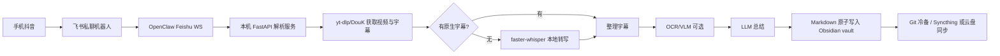

# 联网资料吸收记录：抖音知识视频归档到 Obsidian

> 日期：2026-06-19
> 目的：把本轮联网校验结论沉淀到文档，避免 PRD/EXECUTION 只依赖旧调研或经验判断。

## 1. Obsidian 同步能力

结论：

- Obsidian 本体是本地文件夹 vault；多端访问必须另选同步方法。
- 官方一方同步是 **Obsidian Sync**，支持 Windows、macOS、Linux、iOS、Android，带端到端加密、版本历史、选择性同步。
- 官方帮助页同时列出第三方云同步（iCloud、OneDrive、Google Drive）、本地同步（Syncthing）、版本控制（Git + iOS Working Copy）等方式。
- iCloud 官方推荐平台是 macOS/iOS/iPadOS；官方明确警告 iCloud Drive on Windows 可能导致文件重复或损坏。
- OneDrive 官方推荐 Windows/macOS，Android/iOS 都有限制；需要把 vault 标记为离线可用，避免云盘按需下载导致 Obsidian 看不到文件。
- Syncthing 官方帮助页推荐 Windows/macOS/Linux；Android 可用 Syncthing-Fork，iOS 不在官方支持路径内。
- 官方明确建议不要把同一个 vault 同时混用多种同步服务，避免冲突或损坏。

文档影响：

- PRD/EXECUTION 不能写死“Syncthing = 所有手机主同步”。应该写成分层策略：
  - M1：PC 本地 vault + Git 冷备，先保证解析和入库。
  - M2：如果手机端是 Android，可启用 Syncthing-Fork；如果是 iOS，优先 Obsidian Sync 或 iCloud/Working Copy。
  - M4：评估 iCloud/OneDrive，但只能作为主同步之一或镜像分发，不能与 Syncthing 双主并发写。

来源：

- [Obsidian Help: Sync your notes across devices](https://obsidian.md/help/sync-notes)
- [Obsidian Sync](https://obsidian.md/sync)

## 2. Obsidian 写入和 MCP

结论：

- 最稳主链路仍是“文件系统直写 Markdown”：Obsidian 关闭时也能入库，脚本/CI/常驻服务都能跑。
- Obsidian URI 官方支持打开或创建笔记，适合手动/交互自动化，不适合长文本批量后台写入。
- Local REST API 插件可提供 `/vault/{path}` 读写、搜索、命令执行，以及内置 MCP server；但它要求 Obsidian 客户端在线，并依赖 bearer token/自签证书。
- Local REST API/MCP 适合作为后续增强：让 Claude Code/Codex/OpenClaw 查询 vault、打开当前笔记、补充元数据；不应作为 M1 唯一写入路径。

文档影响：

- 保持 PRD F7 主方案“直接文件系统写入 + 原子 rename”。
- EXECUTION 可以把 Local REST API/MCP 放在可选增强章节，而非 M1 必需依赖。

来源：

- [Obsidian URI Help](https://obsidian.md/help/uri)
- [Obsidian Local REST API GitHub](https://github.com/coddingtonbear/obsidian-local-rest-api)

## 3. OpenClaw + 飞书通道

结论：

- OpenClaw Feishu 官方文档写明：支持 bot 私聊和群聊，WebSocket 是默认模式，webhook 是可选模式。
- 这支持当前架构选择：飞书事件先进 OpenClaw，由 OpenClaw 在本机调用 `127.0.0.1` 解析服务，不需要公网 tunnel。
- 飞书自定义机器人支持 webhook 推送与签名/IP/关键词等安全设置；若后续暴露 webhook 模式，必须启用签名或 IP 白名单。

文档影响：

- M1 继续走 OpenClaw WebSocket + 本地 FastAPI bridge。
- webhook/tunnel 只作为替代路径，且必须加安全设置。

来源：

- [OpenClaw Feishu channel docs](https://docs.openclaw.ai/channels/feishu)
- [飞书开放平台：自定义机器人使用指南](https://open.feishu.cn/document/client-docs/bot-v3/add-custom-bot)

## 4. 抖音抓取与字幕

结论：

- yt-dlp 仍应作为主链路，但抖音抓取对新鲜 cookie 敏感，近期 issue 仍常见 “Fresh cookies needed” 和 JSON 解析失败。
- Douyin/DouK/TikTokDownloader 类工具适合作为备援，尤其是短链、图集、实况图、cookie 引导。
- 经验类视频链路基本一致：URL -> 下载/取字幕 -> ffmpeg 抽音频 -> Whisper/faster-whisper -> LLM 总结 -> Markdown。

文档影响：

- 保持“yt-dlp 主 + DouK 备 + cookie 新鲜度预检”的 F2 方案。
- F3 必须继续“字幕优先”，命中字幕时不跑 Whisper。

来源：

- [yt-dlp Douyin fresh cookies issue](https://github.com/yt-dlp/yt-dlp/issues/12669)
- [jiji262/douyin-downloader](https://github.com/jiji262/douyin-downloader)
- [video-to-subtitle-summary skill](https://github.com/imlewc/video-to-subtitle-summary-skill)

## 5. 本地 ASR / Whisper

结论：

- faster-whisper 官方示例支持 GPU FP16 / INT8，`large-v3` 可直接用 CUDA 跑。
- 对 Jovi 的 4070S 12GB，faster-whisper + 中文优化模型可作为长期本地主路径；M1 可先装好但默认关闭，M2 启用 Whisper 兜底。
- 云端 ASR/MiMo ASR 可保留为可切换适配器，但长期隐私和成本优先仍应偏本地。

文档影响：

- 保持 F4 “字幕未命中 -> 本地 faster-whisper”。
- EXECUTION 需要强调显存串行和 `Whisper / OCR / VLM / LLM` 不并行。

来源：

- [SYSTRAN faster-whisper GitHub](https://github.com/SYSTRAN/faster-whisper)

## 6. 本轮选型总结

推荐主链路：

核心原则：

1. Obsidian 不解析，只展示。
2. PC 常驻服务解析，文件系统直写。
3. 字幕优先，Whisper 兜底。
4. 4070S 上所有大模型串行执行。
5. 同步通道择一为主，Git 做冷备。
